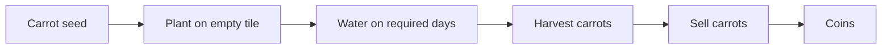
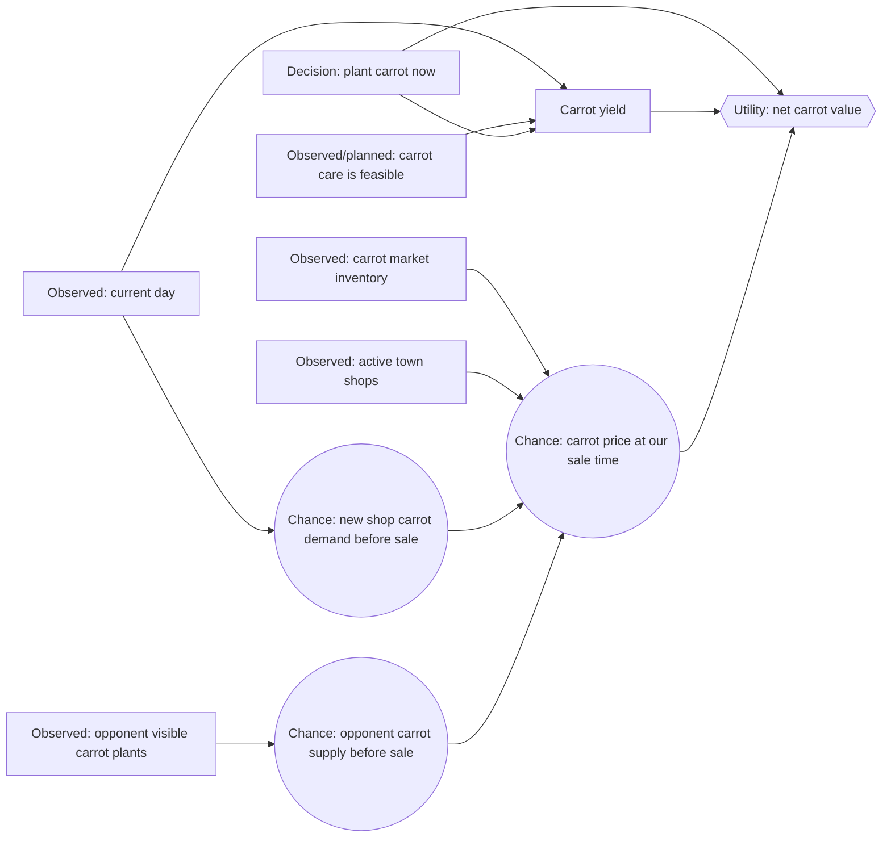
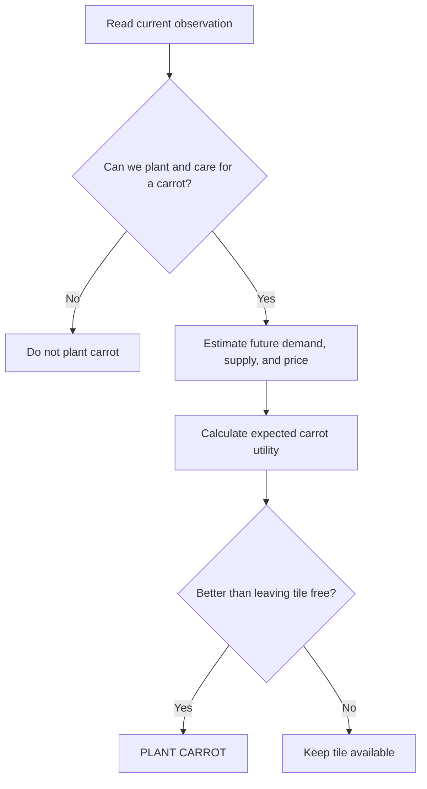
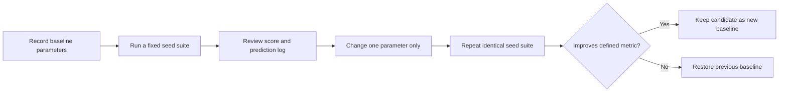

# Carrot Decision Network

This document defines our first small Kaggriculture decision network. Its
single question is:

> **Given one empty, unlocked tile and a carrot seed we already own, should we
> plant a carrot on this turn?**

This is deliberately narrower than “what should the whole farm do?” We are
learning the network one decision at a time.

> **Rendering:** Uses standard fenced `mermaid` blocks, inline `$...$`
> mathematics, and display `$$...$$` mathematics.

## 1. Why carrots are the first crop

Carrots are a simple one-time production chain:



They do not feed animals, cannot be bought back as a commodity, and do not
have repeated production like tomatoes or strawberries. They still give us a
real market decision because town demand and opponent supply can change the
future carrot price.

## 2. Scope and assumptions

For this first network:

- The tile is empty and unlocked.
- We already own at least one carrot seed.
- There is enough season remaining to reach first yield.
- We plan to water the carrot on its planting day, so it does not die that
  night.
- We treat our ability to water and harvest on later days as a separate
  planning problem. It will become another network later.
- We compare `PLANT CARROT` against the alternative of leaving this tile free
  for now. We are **not** yet choosing among every crop type.

This keeps the first model understandable.

## 3. Carrot facts supplied by the game

| Fact | Value under default rules |
|---|---:|
| Seed cost | 20 coins |
| First yield | Age 2 days |
| Peak-yield day | Age 3 days |
| One-time crop | Yes |
| Unfertilized peak yield with watering | 3 carrots |
| Maximum yield with fertilizer and watering | 4 carrots |
| Market purchase allowed | No |
| Market sale allowed | Yes |

The carrot begins with one harvestable unit. Watering in its bonus window
(ages 2 and 3) increases the eventual yield; fertilizer doubles that bonus,
up to the maximum.

## 4. Node types

An influence diagram has three kinds of nodes:

| Type | In this network | Meaning |
|---|---|---|
| Evidence | Current day, carrot market inventory, active shops, opponent visible carrot tiles | Observed facts; we condition on them. |
| Chance | Future carrot demand, opponent carrot sales, carrot price at sale time | Unknown future events represented by probabilities. |
| Decision | Plant a carrot now? | Our agent chooses a value. |
| Utility | Net value of the carrot decision | The score used to compare choices. |

## 5. The first carrot influence diagram



Each arrow says “this parent helps determine this child.” It is not a logical
implication and it is not a data-flow diagram.

## 6. Known carrot demand

The town center consumes one of every non-fertilizer product, including carrot,
once per day. That demand is known and constant:

$$
TownCenterCarrotDemand = 1\ \text{carrot per day}
$$

Active shops are also known. Each instance consumes on a fixed schedule:

| Shop | Carrot consumption | Per-day rate |
|---|---:|---:|
| Pet Café | 2 carrots every 4 turns | 12 carrots/day |
| Farmers Market | 1 carrot every 4 turns | 6 carrots/day |
| All other shops | 0 | 0 |

Duplicate shop instances count separately. For example, two Pet Cafés consume
24 carrots per day.

## 7. The first chance node: a future shop

Future shop identities are random, drawn uniformly from eight shop types with
replacement. For one future draw:

$$
P(\operatorname{NextShopIsPetCafe}) = \frac{1}{8}
$$

$$
P(\operatorname{NextShopIsFarmersMarket}) = \frac{1}{8}
$$

Therefore, a next shop has carrot demand with probability:

$$
P(\operatorname{NextShopDemandsCarrot}) = \frac{2}{8} = 0.25
$$

But this binary version loses an important detail: a Pet Café consumes twice as
many carrots as a Farmers Market. A better chance variable has three values:

| Value of `NewShopCarrotDemand` | Probability | Added carrot demand per day |
|---|---:|---:|
| `NONE` | $6/8$ | 0 |
| `FARMERS_MARKET` | $1/8$ | 6 |
| `PET_CAFE` | $1/8$ | 12 |

Only include this node if a shop can unlock before our intended carrot sale.
Carrots first yield after two days, so sometimes no shop-unlock event lies in
the relevant horizon.

## 8. The second chance node: opponent carrot supply

The opponent's private shed is hidden. Their visible carrot plants are evidence
of future supply, but are not proof that they will sell those carrots.

$$
P(\operatorname{OpponentCarrotSupplyHigh}
\mid \operatorname{VisibleOpponentCarrotTiles},
       \operatorname{CropAges})
$$

An initial, intentionally simple belief table could be:

| Visible ripe or nearly ripe opponent carrot tiles | Probability of high opponent carrot supply before our sale |
|---:|---:|
| 0 | 0.05 |
| 1–3 | 0.30 |
| 4 or more | 0.70 |

These are **initial model parameters**, not game facts. We will later compare
them against replay evidence and revise them.

## 9. Future price and expected utility

The future carrot price is influenced by current inventory, known town demand,
future shop demand, and opponent supply:

$$
P(Price_{sale}
\mid Inventory_{now},
       ActiveShops,
       NewShopCarrotDemand,
       OpponentCarrotSupply)
$$

For this first version, we summarize the price as a small set of values:

```text
LOW     — a glut or weak demand makes carrot sales unattractive
NORMAL  — price is near the current/base price
HIGH    — scarcity or strong demand raises the price
```

The utility of planting one carrot seed is:

$$
U(\operatorname{PlantCarrot})
=
E[Yield \times Price_{sale}]
- 20
- OpportunityCost
$$

The 20 is the fixed seed cost. `OpportunityCost` means the value lost by using
this tile and future actions for carrots instead of another plan. For now, we
can set it to zero while learning the mechanics, then add it later.

If we choose a baseline care plan that produces three carrots, this becomes:

$$
U(\operatorname{PlantCarrot})
\approx
3 \times E[Price_{sale}] - 20
$$

## 10. What the agent does with the network

1. Read the observed evidence from the current turn.
2. Check that planting is legal and that the care plan is feasible.
3. Use the future-shop and opponent-supply belief tables to estimate future
   carrot price.
4. Calculate expected utility for `PLANT CARROT`.
5. Compare it with the utility of leaving the tile free.
6. Plant only if the carrot decision has higher expected utility.



### 10.1 `PASS` is the baseline alternative

The agent does not need an artificial minimum-profit threshold in this first
network. It compares planting with a real game action: `PASS`.

$$
U(\operatorname{PASS}) = 0
$$

$$
\operatorname{Choose\ PLANT\ CARROT}
\quad\text{if and only if}\quad
U(\operatorname{PLANT\ CARROT}) > U(\operatorname{PASS})
$$

When their utilities are equal, this first agent chooses `PASS`. A later
network may assign `PASS` a nonzero option value for keeping a tile and future
actions available; that is intentionally out of scope for now.

### 10.2 Two accounting boundaries

There are two valid ways to account for the 20-coin carrot seed cost. We must
not charge it twice.

| Decision being evaluated | Cost included now |
|---|---:|
| `BUY_SEED` followed by `PLANT CARROT` | 20 coins |
| `PLANT CARROT` when the seed is already owned | 0 immediate coins; use the seed's opportunity/replacement value if needed |

The framework uses a 20-coin **seed opportunity value** by default. This lets
the local `PLANT` versus `PASS` choice act as though consuming a carrot seed
uses an asset that could otherwise be retained for later. The continuous
carrot-investment calculation charges the actual 20-coin market purchase only
when it orders a new seed.

## 11. Explicitly out of scope for now

We will add these only after this network is clear and tested:

- Choosing carrot versus wheat, melon, tomato, or strawberry.
- Buying a carrot seed as part of the same decision.
- Fertilizer acquisition and its yield bonus.
- Farm-hand hiring and action scheduling.
- Land purchases and tile-capacity value.
- Full opponent hidden-shed tracking across many turns.
- Selling a large carrot batch, where our own sales alter later unit prices.

## 12. Experiment axes: what may change from run to run

The purpose of repeated seeded matches is not to randomly change everything.
Each experiment changes one explicitly named model parameter while holding the
game seed, opponent, and all other parameters fixed.

### 12.1 Fixed game facts — do not tune these

These values come from Kaggriculture's rules. If a run goes badly, we do not
change them to make the model look better.

| Fixed fact | Examples |
|---|---|
| Carrot mechanics | Seed cost, growth days, watering bonus, and yield cap |
| Town mechanics | Town-center demand and shop consumption schedules |
| Shop randomness | Each future shop type has probability $1/8$ |
| Market mechanics | Inventory changes and the carrot price function |
| Market permissions | Carrots can be sold but cannot be bought back |

For example, this is a game fact, not a parameter to calibrate:

$$
P(\operatorname{NextShopIsPetCafe}) = \frac{1}{8}
$$

### 12.2 Tunable belief parameters

These numbers summarize uncertainty that the observation does not reveal. They
begin as stated assumptions and can be improved using repeated matches and
replays.

| Axis | Example parameter | Meaning |
|---|---|---|
| Opponent-supply belief | $P(HighSupply \mid 1\text{–}3\ \text{ripe opponent carrots}) = 0.30$ | How strongly visible opponent carrots predict a glut |
| Evidence weighting | A ripe carrot counts more than a newly planted carrot | How crop age changes the supply belief |
| Price belief | $P(LOW \mid HighSupply, NoNewDemand)$ | How supply and demand map to a future price category |
| Demand horizon | Include only shop unlocks before our planned sale | How far ahead the model looks |

Every probability must stay between 0 and 1. When a probability table lists
exclusive outcomes, each row must add up to 1.

For example, this price-belief row is valid:

| Conditions | $P(LOW)$ | $P(NORMAL)$ | $P(HIGH)$ |
|---|---:|---:|---:|
| High opponent supply, no new carrot-demand shop | 0.70 | 0.25 | 0.05 |

because:

$$
0.70 + 0.25 + 0.05 = 1
$$

### 12.3 Tunable decision-policy parameters

These are not beliefs about the world. They express how cautiously the agent
acts on those beliefs.

| Axis | Example parameter | Effect |
|---|---|---|
| Risk penalty | $\lambda$ in cautious price | Larger values penalize uncertain outcomes more strongly |
| Planting margin | `minimum_advantage_to_plant` | Requires carrots to beat waiting by a chosen amount |
| Opportunity cost | `tile_action_opportunity_cost` | Values the tile and future care actions consumed by carrots |
| Yield assumption | Baseline of 3 carrots versus a fertilized plan of 4 | Changes the value expected from successful care |

The cautious-price rule is:

$$
\operatorname{CautiousPrice}
= \operatorname{MeanPrice}
- \lambda \cdot \operatorname{PriceUncertainty}
$$

Increasing $\lambda$ does not claim that the market has changed. It only makes
our decision policy less willing to risk an uncertain carrot investment.

## 13. How to run one controlled experiment



The controls that must remain fixed in a comparison are:

- random seed or fixed suite of seeds;
- episode length and game configuration;
- opponent implementation;
- agent implementation, except for the one named parameter change.

### 13.1 First recommended experiment

Start by changing only this belief:

$$
P(\operatorname{OpponentCarrotSupplyHigh}
\mid 1\text{–}3\ \text{ripe opponent carrot tiles})
$$

For example, compare a baseline of $0.30$ with a candidate of $0.35$. Do not
also change the risk penalty, price table, or planting threshold in the same
experiment. Otherwise we cannot tell which change caused the result.

## 14. Score decisions and probabilities separately

A winning match does not prove that every probability was well calibrated; it
may have been a lucky outcome. Conversely, a sound belief can lead to a loss in
one unlucky match. We track two kinds of score.

### 14.1 Decision outcomes

- final bank balance;
- win/loss against a fixed opponent;
- number of carrots planted and harvested;
- carrot revenue and average carrot sale price.

### 14.2 Belief calibration

For every predicted event, log:

```text
predicted probability p
actual outcome y, where y = 1 if the event happened and y = 0 otherwise
```

One simple calibration score is the Brier score:

$$
\operatorname{BrierScore} = (p-y)^2
$$

Lower is better. Across many predictions, average the score:

$$
\operatorname{MeanBrierScore}
= \frac{1}{N}\sum_{i=1}^{N}(p_i-y_i)^2
$$

Example: predicting a 70% chance of high opponent carrot supply and observing
that it did occur gives:

$$
(0.70 - 1)^2 = 0.09
$$

The same prediction when high supply does not occur gives:

$$
(0.70 - 0)^2 = 0.49
$$

Over enough matches, well-calibrated probabilities receive lower average
scores. This lets us improve the belief network itself, separately from whether
its current decision policy earns the most money.

## 15. Initial agents to compare

We will study these agents before adding more crops or production chains.

| Agent | Economic behavior | Purpose |
|---|---|---|
| Built-in `pass` | Performs no useful work at all | Sanity check only |
| Carrot conveyor | Buys seeds, plants carrots whenever possible, waters, harvests at peak, and sells carrots | Deterministic baseline with no beliefs |
| Carrot decision agent | Performs the same care work but chooses `PLANT CARROT` or `PASS` from this network | Tests whether beliefs improve the baseline |

The carrot conveyor is the meaningful comparison. It answers: “Does the
decision network beat a farmer who simply grows carrots continuously?”
