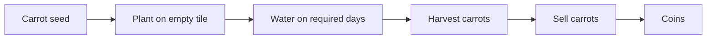
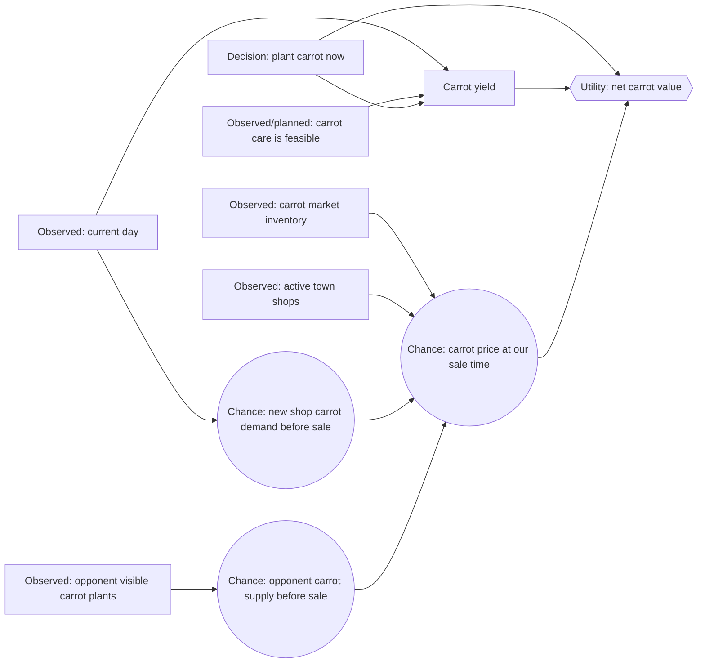
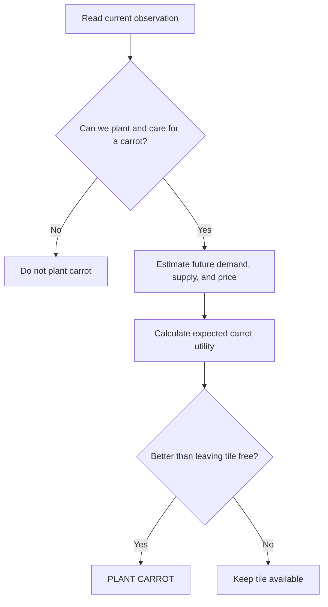

# Carrot Decision Network

This document defines our first small Kaggriculture decision network. Its
single question is:

> **Given one empty, unlocked tile and a carrot seed we already own, should we
> plant a carrot on this turn?**

This is deliberately narrower than “what should the whole farm do?” We are
learning the network one decision at a time.

> **Rendering:** Uses standard fenced `mermaid` blocks, inline `$...$`
> mathematics, and display `$$...$$` mathematics.

## 1. Why carrots are the first crop

Carrots are a simple one-time production chain:



They do not feed animals, cannot be bought back as a commodity, and do not
have repeated production like tomatoes or strawberries. They still give us a
real market decision because town demand and opponent supply can change the
future carrot price.

## 2. Scope and assumptions

For this first network:

- The tile is empty and unlocked.
- We already own at least one carrot seed.
- There is enough season remaining to reach first yield.
- We plan to water the carrot on its planting day, so it does not die that
  night.
- We treat our ability to water and harvest on later days as a separate
  planning problem. It will become another network later.
- We compare `PLANT CARROT` against the alternative of leaving this tile free
  for now. We are **not** yet choosing among every crop type.

This keeps the first model understandable.

## 3. Carrot facts supplied by the game

| Fact | Value under default rules |
|---|---:|
| Seed cost | 20 coins |
| First yield | Age 2 days |
| Peak-yield day | Age 3 days |
| One-time crop | Yes |
| Unfertilized peak yield with watering | 3 carrots |
| Maximum yield with fertilizer and watering | 4 carrots |
| Market purchase allowed | No |
| Market sale allowed | Yes |

The carrot begins with one harvestable unit. Watering in its bonus window
(ages 2 and 3) increases the eventual yield; fertilizer doubles that bonus,
up to the maximum.

## 4. Node types

An influence diagram has three kinds of nodes:

| Type | In this network | Meaning |
|---|---|---|
| Evidence | Current day, carrot market inventory, active shops, opponent visible carrot tiles | Observed facts; we condition on them. |
| Chance | Future carrot demand, opponent carrot sales, carrot price at sale time | Unknown future events represented by probabilities. |
| Decision | Plant a carrot now? | Our agent chooses a value. |
| Utility | Net value of the carrot decision | The score used to compare choices. |

## 5. The first carrot influence diagram



Each arrow says “this parent helps determine this child.” It is not a logical
implication and it is not a data-flow diagram.

## 6. Known carrot demand

The town center consumes one of every non-fertilizer product, including carrot,
once per day. That demand is known and constant:

$$
TownCenterCarrotDemand = 1\ \text{carrot per day}
$$

Active shops are also known. Each instance consumes on a fixed schedule:

| Shop | Carrot consumption | Per-day rate |
|---|---:|---:|
| Pet Café | 2 carrots every 4 turns | 12 carrots/day |
| Farmers Market | 1 carrot every 4 turns | 6 carrots/day |
| All other shops | 0 | 0 |

Duplicate shop instances count separately. For example, two Pet Cafés consume
24 carrots per day.

## 7. The first chance node: a future shop

Future shop identities are random, drawn uniformly from eight shop types with
replacement. For one future draw:

$$
P(\operatorname{NextShopIsPetCafe}) = \frac{1}{8}
$$

$$
P(\operatorname{NextShopIsFarmersMarket}) = \frac{1}{8}
$$

Therefore, a next shop has carrot demand with probability:

$$
P(\operatorname{NextShopDemandsCarrot}) = \frac{2}{8} = 0.25
$$

But this binary version loses an important detail: a Pet Café consumes twice as
many carrots as a Farmers Market. A better chance variable has three values:

| Value of `NewShopCarrotDemand` | Probability | Added carrot demand per day |
|---|---:|---:|
| `NONE` | $6/8$ | 0 |
| `FARMERS_MARKET` | $1/8$ | 6 |
| `PET_CAFE` | $1/8$ | 12 |

Only include this node if a shop can unlock before our intended carrot sale.
Carrots first yield after two days, so sometimes no shop-unlock event lies in
the relevant horizon.

## 8. The second chance node: opponent carrot supply

The opponent's private shed is hidden. Their visible carrot plants are evidence
of future supply, but are not proof that they will sell those carrots.

$$
P(\operatorname{OpponentCarrotSupplyHigh}
\mid \operatorname{VisibleOpponentCarrotTiles},
       \operatorname{CropAges})
$$

An initial, intentionally simple belief table could be:

| Visible ripe or nearly ripe opponent carrot tiles | Probability of high opponent carrot supply before our sale |
|---:|---:|
| 0 | 0.05 |
| 1–3 | 0.30 |
| 4 or more | 0.70 |

These are **initial model parameters**, not game facts. We will later compare
them against replay evidence and revise them.

## 9. Future price and expected utility

The future carrot price is influenced by current inventory, known town demand,
future shop demand, and opponent supply:

$$
P(Price_{sale}
\mid Inventory_{now},
       ActiveShops,
       NewShopCarrotDemand,
       OpponentCarrotSupply)
$$

For this first version, we summarize the price as a small set of values:

```text
LOW     — a glut or weak demand makes carrot sales unattractive
NORMAL  — price is near the current/base price
HIGH    — scarcity or strong demand raises the price
```

The utility of planting one carrot seed is:

$$
U(\operatorname{PlantCarrot})
=
E[Yield \times Price_{sale}]
- 20
- OpportunityCost
$$

The 20 is the fixed seed cost. `OpportunityCost` means the value lost by using
this tile and future actions for carrots instead of another plan. For now, we
can set it to zero while learning the mechanics, then add it later.

If we choose a baseline care plan that produces three carrots, this becomes:

$$
U(\operatorname{PlantCarrot})
\approx
3 \times E[Price_{sale}] - 20
$$

## 10. What the agent does with the network

1. Read the observed evidence from the current turn.
2. Check that planting is legal and that the care plan is feasible.
3. Use the future-shop and opponent-supply belief tables to estimate future
   carrot price.
4. Calculate expected utility for `PLANT CARROT`.
5. Compare it with the utility of leaving the tile free.
6. Plant only if the carrot decision has higher expected utility.



## 11. Explicitly out of scope for now

We will add these only after this network is clear and tested:

- Choosing carrot versus wheat, melon, tomato, or strawberry.
- Buying a carrot seed as part of the same decision.
- Fertilizer acquisition and its yield bonus.
- Farm-hand hiring and action scheduling.
- Land purchases and tile-capacity value.
- Full opponent hidden-shed tracking across many turns.
- Selling a large carrot batch, where our own sales alter later unit prices.
