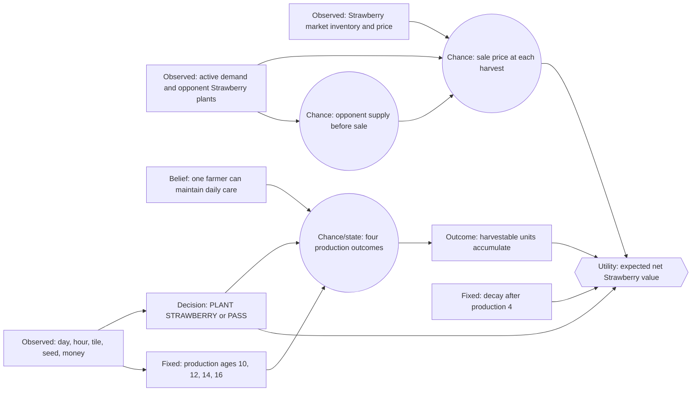

# Strawberry Decision Network

This is the Strawberry counterpart to the Tomato ongoing-crop graph. Its
narrow question is:

> Given one empty unlocked tile and a Strawberry seed or enough money to buy
> one, should the farmer plant Strawberry now or choose `PASS`?

Strawberry remains on the tile after each harvest. It produces on four
scheduled production ages and only begins decay after the final production.

## Scope

- One Strawberry crop.
- One empty, unlocked tile.
- One farmer.
- Plant-versus-`PASS` only.
- No crop portfolio selection.
- No animals, wheat feed chain, hired hands, or Foundry calls.

The lifecycle is supplied by the shared `agents/ongoing_crop.py` interface.
The Strawberry adapter passes an explicit `OngoingCropParameters` object to
that lifecycle; it never relies on an ambient crop or policy module. This
Strawberry fork adds only crop facts, adapters, tests, and this
decision-network document.

## Fixed Strawberry facts

| Fact | Default value |
|---|---:|
| Seed cost | 100 coins |
| Base market price | 120 coins |
| First production age | 10 days |
| Production ages | 10, 12, 14, 16 |
| Scheduled productions | 4 |
| Base yield per production | 1 |
| Fertilized and watered production yield | 2 |
| Care requirement | Water every day |
| Post-production behavior | Decay begins after the fourth production |

These are game rules, not tunable policy values.

## Influence diagram

The schedule is deterministic. Uncertainty is initially about care success,
future market conditions, opponent supply, and realized sale price—not about
the official production ages.

## Production and care

At ages 10, 12, 14, and 16, a live Strawberry plant receives a production
tick. The base production is one Strawberry. If the plant is fertilized and
watered on that production day, the production is doubled to two.

`HARVEST` collects available units but does not remove the plant. The plant
therefore remains available for later scheduled production. After the fourth
production, the game's normal ongoing-crop decay rules apply.

Every plant must be watered daily. Missing two consecutive end-of-day refreshes
turns the plant into a weed, so care feasibility is a safety constraint on the
planting decision.

## Utility

The first model uses today's quote as a transparent point estimate for future
sale price:

$$
E[Yield_i] = P(CareSuccess) \times 1
$$

$$
U(PlantStrawberry)
= \sum_{i=1}^{4} E[Yield_i \times SalePrice_i]
 - SeedOpportunityValue
$$

$$
U(PASS)=0
$$

The policy chooses `PLANT STRAWBERRY` only when:

$$
U(PlantStrawberry) > U(PASS)
$$

The initial implementation uses a named `future_price_multiplier` and a
named care-success probability in the shared helper. Callers pass those
values through `OngoingCropParameters`; no policy source is mutated. These
are provisional belief/preferences, not game facts.

## Fixed facts versus tunable beliefs

Fixed facts:

- seed cost;
- base price;
- production ages;
- four-production cap;
- base and fertilized yields;
- daily watering requirement;
- post-production decay rules.

Potentially tunable beliefs or preferences:

- probability that the farmer completes all required care;
- future sale-price distribution;
- opponent-supply probability;
- seed opportunity value;
- the utility assigned to `PASS`.

The first version does not claim that today's price persists. It uses that
quote only as a transparent placeholder until a price distribution and
resolving labels are defined.

## Known limitations

- One farmer and one active Strawberry are modeled.
- No multi-tile scheduling or crop portfolio selection.
- No fertilizer acquisition decision.
- No sell-now-versus-hold decision.
- No exact forward market simulation.
- No calibrated probability table yet.
- No animal production or wheat-feed value.
- The simulator regression currently covers the exact production schedule,
  daily watering, harvest-without-removal, fourth-production decay marker,
  eventual weed conversion, and fixed-seed deterministic replay.
