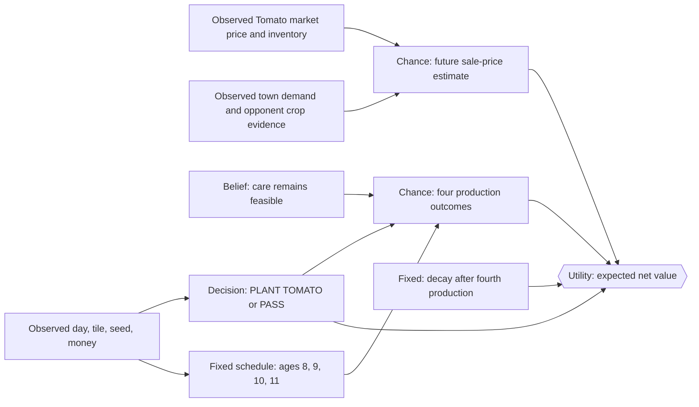

# Tomato Decision Network

This is the first ongoing-crop decision graph. Its narrow question is:

> Given one empty unlocked tile and a Tomato seed or enough money to buy one,
> should the farmer plant Tomato now or choose `PASS`?

Tomato remains on the tile after each harvest and produces on four scheduled
production ages.

## Fixed Tomato facts

| Fact | Default value |
|---|---:|
| Seed cost | 50 |
| Base market price | 60 |
| Production ages | 8, 9, 10, 11 |
| Scheduled productions | 4 |
| Base yield per production | 1 |
| Fertilized and watered production yield | 2 |
| Care | Water every day |
| After the fourth production | Plant begins decay |

These are game rules, not tunable policy weights.

The production schedule is discrete rather than an interval estimate:

| Crop age (days after planting) | Lifecycle event |
|---:|---|
| 8 | Production 1 becomes available |
| 9 | Production 2 becomes available |
| 10 | Production 3 becomes available |
| 11 | Production 4 becomes available |
| after production 4 | Decay begins under the game's ongoing-crop rules |

The agent must water the plant once on every in-game day. On a production day,
watering and fertilization determine the yield for that scheduled production;
watering is not a replacement for the scheduled age. `HARVEST` collects the
currently available units without removing the Tomato, so the same tile remains
eligible for the later production ages. This is the key semantic difference
from the one-time crop examples.

## Influence diagram

The schedule is deterministic. Uncertainty initially comes from care
feasibility and future sale price, not from pretending the game rules are
random.

## Utility

The first model uses a transparent point estimate for future sale price:

$$
E[Yield_i] = P(CareSuccess) \times 1
$$

$$
U(PlantTomato) =
\sum_{i=1}^{4} E[Yield_i \times SalePrice_i]
 - SeedOpportunityValue
$$

$$
U(PASS)=0
$$

The decision plants only when:

$$
U(PlantTomato) > U(PASS)
$$

The initial code uses today's Tomato quote multiplied by a named
`future_price_multiplier`. A later graph version can replace that point
estimate with a `LOW`/`NORMAL`/`HIGH` price distribution.

## Fixed facts versus tunable beliefs and preferences

The following remain fixed because they come from the Kaggriculture rules:

- seed cost, base price, four production ages, and the one-unit base yield;
- the doubled yield condition (fertilized **and** watered on a production day);
- daily watering and the post-production decay lifecycle;
- the plant's ability to remain on its tile after harvest.

The first policy exposes only assumptions that are safe to change in a
controlled experiment:

- `future_price_multiplier`, a provisional point-estimate belief about the
  future sale quote;
- `care_success_probability`, a named belief about completing the daily-care
  plan;
- `seed_opportunity_value` and `pass_utility`, policy preferences rather than
  claims about game mechanics.

Each experiment should change one of these named values while holding the
simulator seed, opponent, episode length, and all other parameters fixed. The
current point estimate is deliberately not presented as a calibrated
probability model.

## Care and harvest semantics

The farmer waters the active Tomato every day. On a production day, a
fertilized and watered plant can produce two units; otherwise the base
production is one unit. `HARVEST` collects available units but does not remove
the plant, so later scheduled production remains possible. After the fourth
scheduled production, the plant begins the game's decay process.

## Known limitations

- One farmer and one active Tomato are modeled; multi-tile scheduling is out
  of scope.
- Fertilizer acquisition and market timing are not decision nodes yet.
- Future price is a point estimate, not a calibrated probability distribution.
- The first utility model does not value crop-choice portfolios or animal-feed
  production chains.
- The shared lifecycle tests verify the scheduled production and eventual
  decay against the simulator; broader multi-tile scheduling remains out of
  scope.
