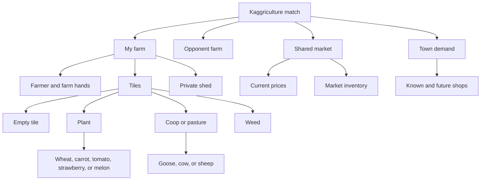
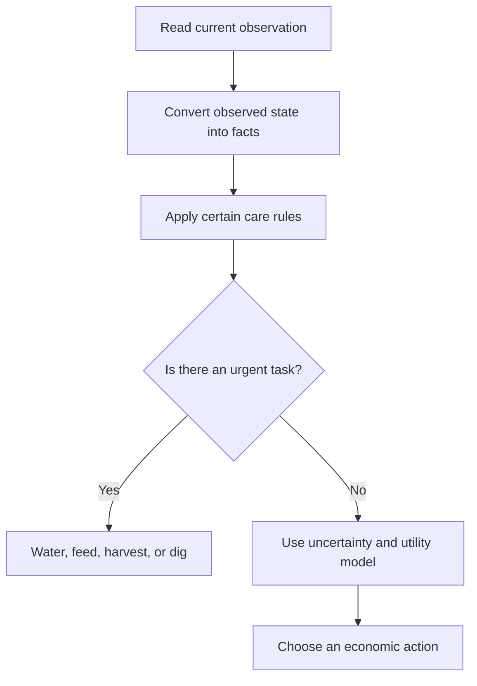
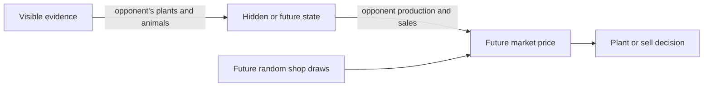
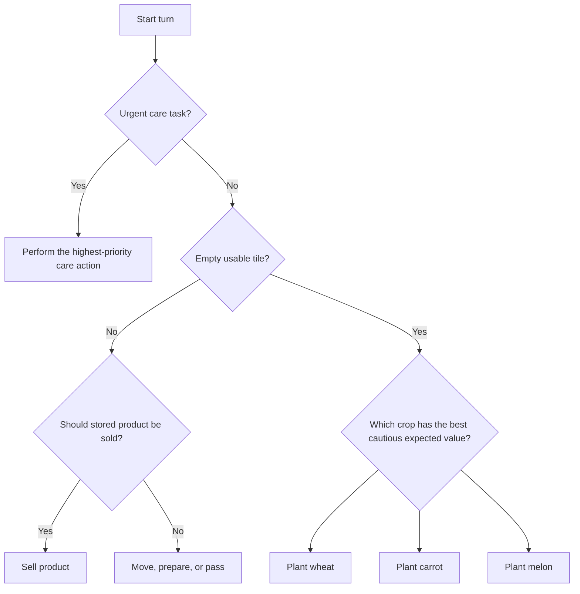
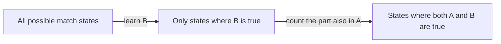

# Kaggriculture: Logic, Uncertainty, and Decisions

These are working notes for learning the uncertainty and decision chapters of
*Artificial Intelligence: A Modern Approach* through Kaggriculture. The goal
is to model the game before trying to optimize it.

> **Rendering:** This document uses standard fenced `mermaid` blocks and
> LaTeX-style mathematics: inline `$...$` and display `$$...$$`. Markdown
> Preview Enhanced and many other Markdown-preview extensions render both.

## 1. The question this agent is trying to answer

At every turn, the agent must choose an action that improves its chance of
finishing the season with the most money.

$$
\operatorname{ChooseAction}(o_t)
= \arg\max_a \operatorname{ExpectedUtility}(a \mid o_t)
$$

Here:

- $o_t$ is the observation at turn $t$;
- $a$ is a candidate action, such as `WATER`, `PLANT WHEAT`, or `SELL`;
- utility will initially mean final bank balance.

We will not try to solve this whole expression at once. We will first describe
what the agent knows, what it does not know, and which rules are certain.

## 2. Domain map



## 3. Three kinds of statements

The most useful distinction in this project is not “logic versus AI.” It is
between **facts**, **certain rules**, and **uncertain beliefs**.

| Kind | Example | How the agent uses it |
|---|---|---|
| Fact | `At(Farmer, Tile(2,3))` | Read directly from the observation. |
| Certain rule | A plant missed for two consecutive days becomes a weed. | Never gamble against it. |
| Uncertain belief | The opponent may sell melons soon. | Assign a probability, then account for risk. |

## 4. Logic notation cheat sheet

| Symbol | Read as | Example |
|---|---|---|
| $\forall$ | “for every” / “for all” | $\forall t\; Plant(t) \Rightarrow Occupied(t)$ |
| $\exists$ | “there exists” | $\exists t\; Weed(t)$ |
| $\land$ | “and” | $Plant(t) \land \neg WateredToday(t)$ |
| $\neg$ | “not” | $\neg WateredToday(t)$ |
| $\Rightarrow$ | “implies” | $Weed(t) \Rightarrow NeedsDigging(t)$ |
| $P(\cdot)$ | “probability of” | $P(ShopDemands(\text{MELON}))$ |
| $P(A \mid B)$ | “probability of $A$, given $B$” | $P(Glut(\text{MELON}) \mid MatureMelons(Opponent))$ |

The letter case matters:

$$
\forall p\; Person(p)
$$

means “for every person $p$.” Here, lowercase $p$ is a variable.

$$
P(\operatorname{Cavity}(p) \mid \operatorname{Toothache}(p))
$$

uses uppercase $P$ as the probability function. In these notes we will avoid
using a bare lowercase $p$ for probability.

## 5. A tiny Kaggriculture vocabulary

We are free to choose readable predicate names. These are not Python function
names yet; they are statements that can be true or false.

```text
At(unit, tile)                 unit stands on tile
Plant(tile)                    tile contains a plant
Crop(tile, crop_kind)          plant on tile has the stated crop kind
WateredToday(tile)             plant on tile has already been watered today
Weed(tile)                     tile contains a weed
Empty(tile)                    tile is empty and unlocked
HasSeed(player, crop_kind)     player owns at least one seed of that crop
NeedsWater(tile)               watering is a useful/safety-critical task
CanWater(unit, tile)           unit can legally water that tile now
```

An observation might give us these facts:

$$
\begin{aligned}
&At(\operatorname{Farmer}, \operatorname{Tile}(2,3)) \\
&Plant(\operatorname{Tile}(2,3)) \\
&Crop(\operatorname{Tile}(2,3), \operatorname{WHEAT}) \\
&\neg WateredToday(\operatorname{Tile}(2,3))
\end{aligned}
$$

## 6. Certain rules

These rules express game mechanics or definitions. They are appropriate for
ordinary first-order logic because they do not depend on an uncertain opponent
or random future event.

### 6.1 A plant that has not been watered needs attention

$$
\forall t\; Plant(t) \land \neg WateredToday(t)
\Rightarrow NeedsWater(t)
$$

### 6.2 A unit standing on an unwatered plant can water it

$$
\forall u,t\; At(u,t) \land Plant(t) \land \neg WateredToday(t)
\Rightarrow CanWater(u,t)
$$

### 6.3 Two consecutive missed days destroy a plant

$$
\forall t\; Plant(t) \land MissedWaterTwoDays(t)
\Rightarrow Weed(t)
$$

This is a **game-law rule**. It does not say that one missed watering makes a
weed; the two-day condition matters.

### 6.4 A weed blocks planting

$$
\forall t\; Weed(t) \Rightarrow \neg Empty(t)
$$

## 7. From facts and rules to an action



For example, the facts in Section 5 plus Rule 6.2 let us infer:

$$
CanWater(\operatorname{Farmer}, \operatorname{Tile}(2,3))
$$

The rule tells us the action is legal. It does **not** by itself prove that
watering is the best action; that is a decision question.

## 8. Where uncertainty begins

Some important game facts are hidden or random:



Examples of uncertain statements:

$$
\begin{aligned}
&P(\operatorname{FutureShopDemands}(\operatorname{MELON})) \\
&P(\operatorname{OpponentSellsSoon}(\operatorname{MELON})
  \mid \operatorname{OpponentHasMatureMelons}) \\
&P(\operatorname{PriceHigh}(\operatorname{MELON})
  \mid \operatorname{FutureShopDemands}(\operatorname{MELON}))
\end{aligned}
$$

These are not hard rules. They are beliefs that can be revised as new market
prices and opponent tiles are observed.

## 9. The first decision tree to build

This is intentionally simple. The next agent can implement this exact shape;
the leaves can later gain probabilities and utility weights.



The word **cautious** is important. A future price estimate should include both
an expected price and uncertainty around it:

$$
\operatorname{CautiousPrice}(c)
= \operatorname{MeanPrice}(c)
- \lambda \cdot \operatorname{PriceUncertainty}(c)
$$

$\lambda$ is a chosen risk weight. It is a transparent parameter that we can
test and alter in later agents.

## 10. Next small exercise

Pick one tile in a replay or live observation and write four facts about it.
Then ask:

1. Which certain rules apply?
2. Which actions are legal?
3. What information is still unknown?
4. Does the next choice need logic, probability, or utility?

We will add the first real probability table only after this vocabulary feels
natural.

## 11. Conditional probability is not “division in logic”

The formula for conditional probability is:

$$
P(A \mid B) = \frac{P(A \land B)}{P(B)}
$$

This can look as though there should be a logical operation that means
“divide by $B$.” There is not. We are **not dividing sets** and we are not
undoing a logical `AND`. We are dividing two *numbers*: the probabilities (or
areas, or counts) assigned to sets.

### 11.1 The Venn-diagram interpretation

In a Venn diagram:

- $A \land B$, also written $A \cap B$, is the overlapping region;
- $B$ is the entire $B$ circle.

The ratio asks:

> Of all cases in which $B$ is true, what fraction also make $A$ true?

Conditioning on $B$ means temporarily treating the $B$ circle as the new
universe and rescaling its total probability to $1$.



For a Kaggriculture example, let:

$$
\begin{aligned}
A &= \text{Opponent sells melons soon} \\
B &= \text{Opponent has mature melon plants}
\end{aligned}
$$

Suppose 100 recorded matches contain:

- 20 matches where $B$ is true;
- 12 matches where both $A$ and $B$ are true.

Then:

$$
P(A \mid B)
= \frac{12/100}{20/100}
= \frac{12}{20}
= 0.6
$$

Given mature melon plants, the estimated chance of an imminent melon sale is
60%. The division is ordinary arithmetic on the two probabilities.

### 11.2 Logic and probability use related, but different, operations

| Logic / set idea | Symbol | Probability expression | Important caution |
|---|---|---|---|
| AND / intersection | $A \land B$ or $A \cap B$ | $P(A \land B)$ | It is not automatically $P(A)P(B)$. |
| OR / union | $A \lor B$ or $A \cup B$ | $P(A \lor B)$ | Overlap must not be counted twice. |
| NOT / complement | $\neg A$ | $P(\neg A) = 1 - P(A)$ | This is a true numeric complement. |
| Implication | $B \Rightarrow A$ | special case $P(A \mid B)=1$ | Implication demands certainty. |

The product rule is the general connection between AND and conditional
probability:

$$
P(A \land B) = P(A \mid B)P(B)
$$

If $A$ and $B$ are independent, knowing $B$ changes nothing about $A$, so:

$$
P(A \mid B) = P(A)
$$

and only then can we write:

$$
P(A \land B) = P(A)P(B)
$$

There is no inverse of AND in logic: from $A \land B$ alone, we cannot recover
which cases were in $A$ but not $B$, nor which were in $B$ but not $A$.

### 11.3 Implication versus evidence

$$
B \Rightarrow A
$$

means: “whenever $B$ is true, $A$ is certainly true.” In Kaggriculture terms,
it would mean that an opponent with mature melons **always** sells melons soon.
That is far too strong.

$$
P(A \mid B) = 0.6
$$

means: “after observing $B$, assign probability 0.6 to $A$.” Mature melons are
evidence for a sale; they are not a logical guarantee of one.
