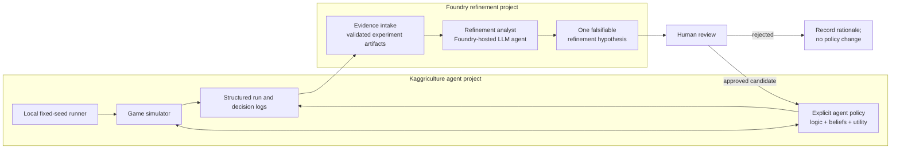

# Foundry Refinement Architecture for Kaggriculture Agents

## Status and purpose

This document records the current architecture for the **Microsoft Foundry
refinement project** that supports this Kaggriculture agent workspace.

It is a design and learning architecture, not a record of a deployed Foundry
application. No Azure resource, Foundry project, model deployment, external
connector, or scheduled workflow is implied by this document.

The central design decision is:

> The Kaggriculture policy remains an explicit, local, inspectable symbolic
> and probabilistic program. Foundry operates outside the game loop as an
> analyst that proposes refinements to that program, which are then evaluated
> by controlled local simulations.

This preserves the point of the project: relearning symbolic AI, probability,
and decision theory through an understandable game domain. A language model is
not a replacement for the agent's belief network or utility calculation.

## 1. System boundary

There are two cooperating systems with different responsibilities.



The arrows from Foundry toward the agent are deliberately indirect. A Foundry
agent may recommend a code or parameter change; a human decides whether to
make it, and the local evaluation loop decides whether the evidence supports
keeping it.

## 2. Kaggriculture system: the system under refinement

The Kaggriculture agent is the subject of experimentation. It receives an
observation from the simulator and returns valid game actions. Its decision
logic must remain understandable from source code and game rules.

The current first example is the carrot decision network:

- The **conveyor** policy is a non-probabilistic baseline: keep attempting the
  carrot farming cycle.
- The **decision** policy uses visible evidence to estimate future carrot price
  categories and chooses `PLANT CARROT` only when the expected utility exceeds
  the utility of `PASS`.
- Game mechanics such as seed price, growth days, watering, yield rules, town
  demand, and market rules are fixed facts. They are not tuned to improve a
  score.
- Uncertain relations—such as whether visible opponent carrots predict future
  supply—are named belief assumptions. They may be calibrated with evidence.

The current implementation expresses this separation in:

- `agents/carrot/shared.py`: game facts, named belief parameters, inference,
  expected-utility calculation, and shared care/movement helpers.
- `agents/carrot/conveyor.py`: the unconditional comparison policy.
- `agents/carrot/decision.py`: the belief-based policy and Kaggle `agent(obs)`
  entry point.
- `carrot-decision-network.md`: the human-readable influence diagram,
  assumptions, and controlled-experiment rules.

The agent's online decision path is intentionally independent of Foundry. A
game may run locally, in the Kaggle environment, or in a test harness without
network access, cloud credentials, or an LLM response.

## 3. Foundry system: the refinement tool

The Foundry project is a **research and refinement control plane**. Its job is
to help a human reason about evidence produced by simulations.

It should perform these tasks:

1. Read a bounded, structured experiment package rather than arbitrary source
   code or a raw game replay by default.
2. Summarize what changed, what was held constant, and what outcome changed.
3. Diagnose candidate failure modes using the recorded evidence.
4. Distinguish fixed game facts from tunable beliefs and policy preferences.
5. Propose one small, falsifiable next change or one additional measurement.
6. State what result would support or refute the proposal.
7. Explain uncertainty and competing explanations instead of turning one noisy
   run into a confident story.

It should not perform these tasks:

- choose a turn-by-turn Kaggriculture action;
- silently edit an agent or a parameter file;
- change several parameters at once;
- reinterpret or overwrite the official game rules;
- declare a candidate better without matched controlled runs;
- submit an agent to Kaggle or manage production credentials;
- replace human judgment about which learning direction is worthwhile.

## 4. Control plane versus game-time data plane

The separation can be expressed as two distinct loops.

| Concern | Game-time data plane | Foundry refinement control plane |
|---|---|---|
| Main objective | Select a legal action this turn | Improve an explicit policy between experiments |
| Latency expectation | One game turn | Minutes or longer is acceptable |
| Inputs | Current game observation | Frozen summaries, traces, metrics, and experiment metadata |
| Output | Kaggriculture action dictionary | Hypothesis, explanation, and proposed experiment |
| Permitted effect | Game action only | No direct code/policy mutation |
| Ground truth | Simulator transition and reward | Controlled experiment results |
| Failure fallback | Continue with deterministic policy | Produce no recommendation; retain current baseline |

This boundary is not merely operational convenience. It protects the learning
goal. The policy can be read as an influence diagram and tested as a program;
Foundry's contribution is a reviewable scientific suggestion, not hidden
runtime reasoning.

## 5. Evidence contract for refinement

Foundry should receive an experiment package with explicit provenance. The
initial package can be a versioned JSON document or a small collection of JSON
and CSV files generated by the local runner. The exact storage and transport
mechanism remains a future implementation choice.

### 5.1 Experiment manifest

Every result set needs enough metadata to reproduce its comparison.

```json
{
  "experiment_id": "carrot-supply-prior-v1",
  "purpose": "Test a single opponent-supply belief change",
  "baseline": {
    "agent": "agents.carrot.decision",
    "revision": "source-control revision or content hash",
    "parameters": {
      "supply_high_given_one_to_three_ripe": 0.30
    }
  },
  "candidate": {
    "agent": "agents.carrot.decision",
    "revision": "same revision except named parameter",
    "parameters": {
      "supply_high_given_one_to_three_ripe": 0.35
    }
  },
  "controls": {
    "seeds": [11, 12, 13],
    "episode_configuration": "identified configuration snapshot",
    "opponent": "identified opponent revision",
    "player_positions": "both assignments when applicable"
  }
}
```

The manifest should make violations obvious: a changed seed suite, different
opponent, or unrecorded second parameter change means the comparison is not a
clean calibration experiment.

### 5.2 Run summary

Each seed and player position should produce a concise summary containing at
least:

- final bank, reward, outcome, and margin;
- the agent and opponent identity;
- seed, configuration, player index, and episode length;
- crops planted, watered, harvested, lost, and sold;
- seed purchases, market sales, and average realized carrot sale price;
- plant versus pass counts for the carrot decision;
- invalid/no-op action count, if detectable;
- optional aggregate market and town-demand indicators.

This summary answers outcome and behavior questions without forcing an analyst
to reconstruct every turn first.

### 5.3 Decision trace

For decisions made by a belief-based policy, record enough pre-action evidence
to evaluate the belief separately from the match result.

```json
{
  "step": 96,
  "day": 4,
  "decision": "PLANT_CARROT",
  "evidence": {
    "carrot_market_inventory": 27,
    "carrot_current_price": 35,
    "active_carrot_shops": ["FARMERS_MARKET"],
    "visible_ripe_opponent_carrot_tiles": 2
  },
  "belief": {
    "high_opponent_supply_probability": 0.30,
    "price_distribution": {"LOW": 0.31, "NORMAL": 0.49, "HIGH": 0.20},
    "expected_sale_price": 32.4
  },
  "utility": {
    "plant_carrot": 77.2,
    "pass": 0.0
  },
  "policy_version": "identified source revision"
}
```

The trace must contain only information observable before the action. Later
outcomes may be attached afterward for scoring, but they must never be mixed
into the action-time evidence presented as if the agent knew them.

### 5.4 Resolved outcomes and calibration labels

Where a prediction can be resolved, add outcome fields later:

- actual sale price and resulting price category;
- whether predicted opponent supply appeared before the sale horizon;
- actual crop care/harvest result;
- realized carrot revenue;
- an explicit label when an outcome cannot be cleanly observed.

This enables accuracy, Brier-score, calibration, and decision-regret analyses.
It also prevents the common mistake of treating a win as proof that every
individual probability was correct.

## 6. Refinement-agent reasoning contract

A Foundry refinement agent should receive a structured prompt or tool payload
with the experiment package above and return a structured recommendation. It
may generate prose for the human, but its machine-readable conclusion should
be constrained.

```json
{
  "assessment": "inconclusive | retain_baseline | test_candidate | investigate",
  "evidence_cited": [
    "seed 11: candidate reduced premature planting",
    "seed 12: no meaningful final-bank difference"
  ],
  "alternative_explanations": [
    "small seed sample",
    "care capacity, not price pessimism, caused losses"
  ],
  "single_hypothesis": {
    "parameter": "supply_high_given_one_to_three_ripe",
    "current_value": 0.30,
    "proposed_value": 0.35,
    "rationale": "...",
    "prediction": "fewer plant decisions; improved average reward against the fixed opponent"
  },
  "next_measurement": "Add care-feasibility count to the decision trace",
  "confidence_and_limits": "..."
}
```

The one-change rule is intentional. A suggestion such as “raise the
opponent-supply prior, lower the high-price multiplier, and add a risk penalty”
is a design brainstorm, not a testable recommendation. The agent should either
rank such ideas for later testing or select one.

## 7. Evaluation architecture

The refinement tool itself must be evaluated. It should not be trusted merely
because its explanations sound plausible.

### 7.1 Ground truth for agent-policy refinements

The primary score is mechanical and comes from matched simulations:

- mean and distribution of final bank/reward across a fixed seed suite;
- paired baseline-versus-candidate difference on the same seeds;
- win rate and player-position sensitivity;
- crop lifecycle outcomes and action validity;
- calibration of price/supply predictions where labels are available.

The Foundry analyst cannot override these results.

### 7.2 Ground truth for Foundry recommendations

Maintain a held-out history of refinement cases. For each recommendation,
record:

- the frozen evidence supplied to the agent;
- the hypothesis it proposed;
- its prediction of the measurable effect;
- whether the later controlled experiment supported that prediction;
- whether the suggestion respected the fixed-fact, one-change, and
  reproducibility constraints;
- a human assessment of whether the explanation accurately cited the evidence.

This lets us evaluate the refiner on usefulness and calibration rather than
only judging its prose informally.

### 7.3 Anti-storytelling safeguards

LLMs are good at proposing coherent explanations for random variation. The
refinement pipeline therefore needs explicit safeguards:

1. Do not show a candidate's held-out results until after the agent predicts
   the direction of change.
2. Require citation to named metrics, seeds, and trace fields.
3. Require uncertainty and at least one alternative explanation.
4. Reject recommendations that alter game facts or more than one policy
   dimension.
5. Prefer an `inconclusive` result when evidence is thin.
6. Keep the baseline configuration reproducible and easy to restore.

## 8. External API and credential boundary

The Foundry refinement project must not call external model, evaluator, or
service APIs. No API keys, access tokens, usage allocation, or spending budget
are supplied for such services, so an integration cannot safely assume that it
may make even one billable request.

This rules out direct calls to TypeSafe Jev and any other third-party LLM,
evaluation, search, storage, or orchestration API. It also rules out silently
adding credentials, asking an operator to supply a key as part of ordinary
operation, or falling back to an external service when a Foundry capability is
unavailable.

If the project later receives explicit authorization, credentials, and a cost
budget for a named provider, that is a new architecture decision. It must be
documented and reviewed before any adapter, connector, or request is added.

Until then, the only permitted refinement inputs are local, reproducible
experiment artifacts and capabilities explicitly approved and provided within
the Foundry project itself.

## 9. Foundry implementation posture

The following are architectural intentions, not an instruction to provision
them now:

- A Foundry-hosted prompt or hosted agent can implement the refinement analyst.
- A Foundry project can retain agent traces, evaluation suites, datasets, and
  result comparisons when that work begins.
- Foundry evaluation capabilities should evaluate the analyst's structured
  recommendations as well as any natural-language explanation.
- The local Kaggriculture workspace remains the source of truth for policy
  code, controlled experiment definitions, and deterministic game results.

Before implementation, select the specific Foundry project, model, data
retention configuration, identity/RBAC approach, evaluation model, and cost
budget. Those choices are intentionally unresolved because they change
operational behavior and may incur cost.

## 10. Delivery stages

### Stage A — Local evidence first

1. Add explicit fixed-seed support to the local runner.
2. Run carrot conveyor versus `pass` and `random`.
3. Run decision policy versus conveyor on identical seed suites.
4. Emit a small, deterministic experiment manifest and run summary.
5. Add decision traces only where a belief-based decision is made.

No Foundry dependency is needed for this stage.

### Stage B — Manual refinement protocol

1. Read the generated evidence as a human.
2. Write one hypothesis and one predicted metric effect.
3. Change one named parameter.
4. Repeat the matched seed suite.
5. Record keep/revert/inconclusive with rationale.

This establishes the scientific control loop before automating commentary.

### Stage C — Foundry analyst in advisory mode

1. Give a Foundry agent a bounded experiment package.
2. Require the structured recommendation contract.
3. Log recommendations beside human hypotheses.
4. Run candidates locally; do not allow automatic policy edits.
5. Measure whether Foundry recommendations predict useful improvements.

### Stage D — Foundry-only evaluator assessment

1. Add an approved Foundry-native evaluator only when the project supplies the
   required capability, identity, and cost authorization.
2. Evaluate it on a frozen decision-trace set.
3. Keep it only if it improves the documented refinement workflow.

## 11. Open decisions

These questions should be answered before building the Foundry refinement
project:

1. What exact artifact format will the local runner emit: JSON Lines, JSON
   package, SQLite, or another small reproducible format?
2. Which metrics count as a successful policy refinement: average reward,
   robust win rate, calibration, care-feasibility, or a stated combination?
3. How many seeds and player-position swaps are required before a result is
   considered informative?
4. Which Foundry project/model is appropriate, and what data-retention and
   cost constraints apply?
5. Will Foundry analyze only aggregated synthetic game data, or are full
   replay traces ever necessary?
6. What human review record is sufficient to accept a refinement into the
   baseline agent?

## 12. Architectural invariants

The following rules should survive later implementation details:

1. Explicit agent policy, game mechanics, and simulation truth remain local and
   inspectable.
2. Fixed game facts and tunable beliefs are never conflated.
3. A refinement is a hypothesis until a controlled experiment tests it.
4. One experiment changes one named policy or belief dimension at a time.
5. Foundry is advisory and cannot mutate the policy or act during a match.
6. LLM explanations must be tied to preserved evidence and allowed to be
   inconclusive.
7. Human review chooses which recommendations enter the local experiment loop.
8. Every retained refinement carries its experiment provenance and rationale.
9. No external API, connector, credential, token, or billable model call may
   be introduced without explicit user authorization, a named provider, and a
   documented usage/cost budget.

Following these invariants lets the Foundry project make the Kaggriculture
agent more teachable and evidence-driven without turning it into an opaque
cloud-controlled policy.
