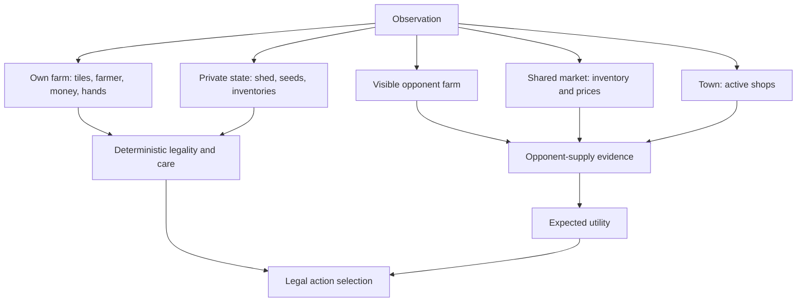
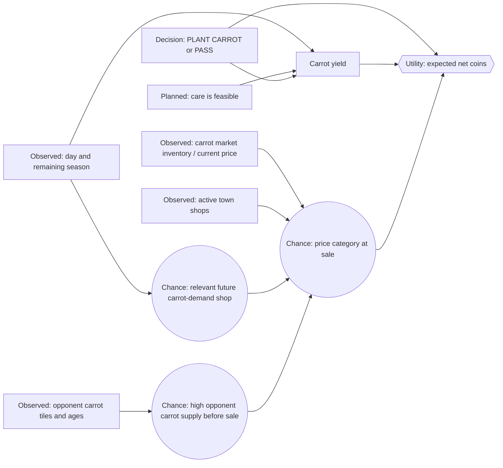
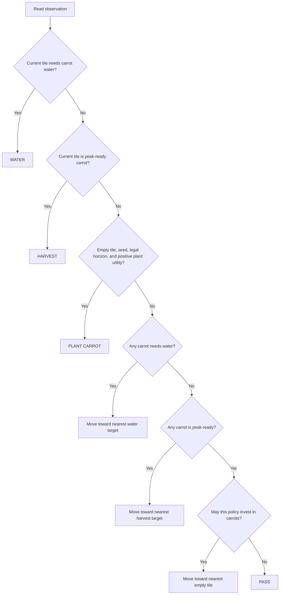
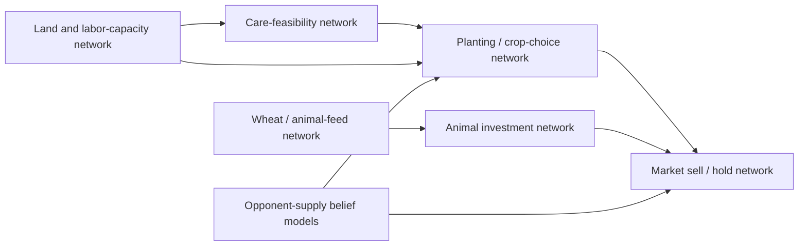

# Kaggriculture Agent Architecture

## Status and intent

This document describes the agent being developed in this repository: a small,
readable Kaggriculture player built to explore symbolic AI, probability,
Bayesian belief networks, influence diagrams, and decision theory.

The goal is not to hide a general-purpose language model behind a game API. The
goal is to make every important assumption inspectable:

- game mechanics are explicit facts;
- uncertainty is represented as named probabilities or distributions;
- action choices follow an explicit utility calculation;
- policy preferences are separate from beliefs about the world;
- experiments reveal whether a belief or policy change helped.

The current implementation is deliberately narrow: it includes the first
carrot decision example and separate, one-tile wheat and melon crop-cycle
examples. They do not jointly choose across crops or model complete farm
strategy.

## 1. Architectural principles

### 1.1 Three kinds of reasoning

The agent separates three kinds of statements that are often accidentally
mixed together.

| Kind | Question answered | Example | Owner |
|---|---|---|---|
| Logic / deterministic rules | What is certainly legal or mechanically true? | A crop missed two refreshes becomes a weed. | Game rules and local code |
| Probability / beliefs | What is uncertain, given current evidence? | How likely is high opponent carrot supply before our sale? | Belief model |
| Utility / preferences | Which available action is worth more? | Is expected carrot value greater than leaving the tile free? | Decision policy |

For example, the following is a game rule, not a probability:

$$
\forall t\quad Plant(t) \land MissedWaterTwoDays(t) \Rightarrow Weed(t)
$$

The following is uncertain because the opponent's shed and future sales are
not fully observable:

$$
P(HighOpponentCarrotSupply\mid VisibleRipeOpponentCarrots)
$$

And the following is a decision comparison:

$$
Choose(PlantCarrot)\quad\text{when}\quad
U(PlantCarrot) > U(Pass)
$$

### 1.2 Explicit assumptions beat implicit intuition

An initial number such as “three visible ripe opponent carrots means a 30%
chance of high supply” is allowed to be wrong. Its value is that it is visible,
named, measured, and replaceable. An unrecorded intuition embedded in complex
control flow cannot be calibrated.

### 1.3 Local, deterministic game-time behavior

The policy must be runnable in a local simulation and Kaggle without network
access, cloud credentials, or an LLM response. Any external analysis is
offline and advisory; it never chooses a game action.

### 1.4 Learn one decision at a time

Kaggriculture contains many coupled choices: crop selection, planting, care,
harvesting, selling, buying, land, farm hands, livestock, and opponent
response. The architecture grows through small influence diagrams rather than
one opaque “best action” model.

The first diagram asks only:

> Given an empty unlocked tile and an already-owned carrot seed, should the
> farmer plant a carrot now or pass?

### 1.5 Crop-network learning sequence

After the carrot example, the next crop studies will focus on wheat and melon.
Each will be treated as an isolated crop cycle—plant, provide required care,
harvest, and consider sale—without modeling the crop's uses in other
production systems. In particular, wheat's role as animal feed stays outside
the wheat crop network for now.

Tomato and strawberry are the next pair after wheat and melon. Their ongoing,
scheduled yields add repeated production and harvest timing to the same basic
crop-cycle question. Animal production and crop-to-animal chains come later,
once these standalone crop networks are understood.

This is a learning sequence, not a claim that one crop is always more
profitable than another:

1. Carrot — current one-time crop example.
2. Wheat and melon — next standalone one-time crop networks.
3. Tomato and strawberry — standalone ongoing-crop networks.
4. Production chains, including wheat as animal feed and animal products.

## 2. Domain model relevant to the agent

Kaggriculture is a two-player, turn-based farm and market simulation. A player
has a grid farm, farmer and optional hands, private shed/seeds, public market,
and public town demand. Important information is asymmetric: both players can
see farm tiles and the market, but not the other player's shed or carried
inventory.



### 2.1 Observable facts

The policy can use the current day and turn, its own money and inventory,
public farm tiles, its unit positions, market prices/inventory, and current
town shops. These are observation facts, not predictions.

### 2.2 Hidden or future variables

The agent does not directly know the opponent's private shed, their future
market orders, future shop draws, future weed events, or future market prices.
Visible crop locations and ages are evidence about some of those variables;
they are not proof.

### 2.3 Timing and care matter

Plants need daily watering and animals need daily feeding. Two consecutive
missed refreshes destroy the crop or cause the animal to escape. Therefore,
care work has a safety-critical character: a promising future investment is
worth little if the farm cannot carry out its required care actions.

The present carrot agent treats later care feasibility as a constrained
assumption. A dedicated care-feasibility network is planned before scaling the
number of planted tiles or adding animal systems.

## 3. Agent package layout

```text
agents/
  carrot/
    shared.py       # Facts, parameters, beliefs, utility, care and movement
    decision.py     # Kaggle entry point for the belief-based policy
    conveyor.py     # Kaggle entry point for the no-belief baseline
  one_time_crop.py  # Shared one-tile loop for wheat and melon examples
  wheat/
    shared.py       # Wheat facts and policy adapters
    decision.py     # Current-quote plant-versus-PASS policy
    conveyor.py     # Unconditional crop-cycle baseline
  melon/
    shared.py       # Melon facts and policy adapters
    decision.py     # Current-quote plant-versus-PASS policy
    conveyor.py     # Unconditional crop-cycle baseline
  archive/
    main_v0.py      # Historical implementation retained for reference
    test_agent_v0.py
main.py             # Current submission entry point: carrot decision policy
run_match.py        # Local reproducible match runner
```

The two policy modules are intentionally thin. Both expose `agent(obs)`, so
they can be loaded by Kaggle or the local runner. Shared mechanics live in one
place so the experiment compares decision logic rather than two independently
drifting implementations.

The wheat and melon examples follow the same folder pattern. Their shared
one-time-crop loop manages at most one active crop of its configured type,
keeping daily care understandable. Each has a conveyor baseline and a
decision entry point. The decision entry points use the observed market quote
as a point estimate for the eventual sale quote, with a named default factor
of 1.0. This is a provisional heuristic, not a calibrated probability
distribution; explicit sale-price beliefs remain the next modeling step.

## 4. Current carrot influence diagram

An influence diagram extends a belief network with an explicit decision and
utility node. The arrows below mean “helps determine,” not logical implication
and not necessarily a direct game-engine causal rule.



### 4.1 Evidence nodes

The current first model reads:

- current day and season horizon;
- current carrot market price and inventory;
- active town shops that consume carrots;
- publicly visible opponent carrot tiles, emphasizing ripe or nearly ripe
  crops;
- whether enough season remains for first yield;
- local tile, seed, and legal-action state.

### 4.2 Chance nodes

The simplified model contains three uncertainty components.

1. **Future carrot demand.** A future town-shop unlock may occur before a
   planned peak harvest. One shop draw can yield no carrot demand, Farmers
   Market demand, or Pet Café demand.
2. **Opponent supply.** Visible crop evidence informs a probability that the
   opponent will add substantial carrot supply before the agent sells.
3. **Future sale price.** Supply and demand evidence are converted into a
   coarse `LOW`, `NORMAL`, or `HIGH` price distribution.

### 4.3 Decision and utility nodes

The action is deliberately binary:

```text
PLANT CARROT
PASS
```

`PASS` is a real action with initial utility zero, not merely an absence of a
threshold. Planting is chosen only on strict improvement:

$$
U(PlantCarrot) > U(Pass) = 0
$$

For the present baseline care plan, the expected value is:

$$
U(PlantCarrot)
= 3 \times E[SalePrice] - SeedOpportunityValue
$$

The three is the planned unfertilized carrot yield when bonus-window watering
is completed. `SeedOpportunityValue` prevents an already-owned seed from being
treated as free merely because its cash cost occurred earlier; its initial
value is its replacement cost. The seed is not charged twice as a new market
purchase.

## 5. Fixed facts versus tunable parameters

This separation is an architectural invariant.

### 5.1 Fixed game facts

The current carrot model treats these as default-rule facts:

| Fact | Current value / interpretation |
|---|---|
| Carrot seed cost | 20 coins |
| First yield day | Age 2 days |
| Planned peak harvest | Age 3 days |
| Baseline cared-for yield | 3 carrots |
| Base carrot price | 35 coins |
| Town-center demand | 1 carrot per day |
| Pet Café demand | 12 carrots per day per instance |
| Farmers Market demand | 6 carrots per day per instance |
| Carrot trade constraint | Can sell, cannot buy back |
| Season duration | 30 days |

If a match goes poorly, the agent does not alter these values to manufacture a
better result. If a game configuration changes, that is a new declared
configuration—not a learned parameter update.

### 5.2 Tunable belief parameters

The `CarrotParameters` record groups all current non-rule assumptions. The
most important conditional belief is:

$$
P(HighOpponentCarrotSupply\mid RipeOrNearlyRipeOpponentCarrotCount)
$$

The initial table is:

| Visible ripe or nearly ripe opponent carrots | Probability of high supply |
|---:|---:|
| 0 | 0.05 |
| 1–3 | 0.30 |
| 4 or more | 0.70 |

Other explicit model parameters include:

- low and high price multipliers relative to the observed current price;
- baseline and evidence weights that turn supply/demand signals into the three
  price-category probabilities;
- an opportunity value for consuming an already-owned seed;
- the utility of `PASS`, initially zero.

The price distribution is clamped and normalized so all categories remain
meaningful and sum to one:

$$
P(LOW) + P(NORMAL) + P(HIGH) = 1
$$

### 5.3 Policy preferences are not world beliefs

A future risk penalty, planting margin, option value of an empty tile, or
fertilized-yield plan is a policy choice, not evidence about the market. For
example, the cautious-price expression

$$
CautiousPrice = MeanPrice - \lambda \times PriceUncertainty
$$

uses the chosen risk weight $\lambda$. Increasing $\lambda$ means the policy
is more conservative; it does not claim that a market price has changed.

## 6. Current policy mechanics

The agent does not make every action probabilistic. Its control flow puts
mechanical preservation before economic expansion.



The priorities are purposeful:

1. Water a current carrot before any other action.
2. Harvest a peak-ready carrot after care.
3. Plant only when the tile is empty, seed is available, and the policy allows
   it.
4. Move to water work before harvest work, and harvest work before planting.

This current policy uses one farmer and no farm hands. It uses Manhattan
distance as a simple movement heuristic. It does not yet solve multi-unit
scheduling, route planning, or future care capacity.

### 6.1 Market behavior in the first framework

The first carrot framework sells all carrots already in the shed and, for a
policy investing in carrots, buys enough seeds for plantable empty tiles up to
the model's limited purchase quantity and affordability. It intentionally does
not yet model:

- sell now versus hold;
- own-sale market-price slippage;
- stockpiling seeds against future market choices;
- purchase competition among crop, animal, land, and hand investments.

These require their own decision networks rather than an unexamined pile of
heuristics.

## 7. Baselines and comparisons

The architecture uses baselines to distinguish genuine decision value from
ordinary farming competence.

| Agent | Behavior | Why it exists |
|---|---|---|
| Built-in `pass` | Does nothing useful | Sanity check for simulator and basic farm loop |
| Built-in `random` | Takes noisy legal actions | Early robustness comparison |
| Carrot conveyor | Always attempts the carrot cycle | Strong local baseline with identical care mechanics but no beliefs |
| Carrot decision policy | Plants only when expected utility beats `PASS` | Tests whether explicit beliefs add value |

The key comparison is decision policy versus carrot conveyor on the same seed
suite. A decision network that cannot outperform, or clearly justify a
trade-off against, unconditional planting has not earned its complexity.

## 8. Controlled experimentation and probability calibration

### 8.1 Reproducible simulation

`run_match.py` can provide an explicit episode seed. A comparison holds the
following constant unless one is the stated variable under study:

- random seed or fixed seed suite;
- episode length and game configuration;
- opponent implementation and player position;
- agent source revision;
- every parameter except the named experimental change.

Player positions should eventually be swapped because being player zero or one
may change the realized market sequence or competitive advantage.

### 8.2 One parameter at a time

A valid initial experiment might compare:

```text
baseline:  P(high opponent supply | 1–3 ripe carrots) = 0.30
candidate: P(high opponent supply | 1–3 ripe carrots) = 0.35
```

It must not simultaneously alter the high-price multiplier, risk penalty, or
care logic. Otherwise a result cannot identify which assumption mattered.

### 8.3 Outcome metrics

Winning one match is not proof that the policy or probability model is good.
Record at least:

- final bank and reward;
- win/loss and margin against the stated opponent;
- carrots planted, watered, harvested, lost, and sold;
- carrot revenue and average realized sale price;
- plant/pass decision count;
- care failures and invalid/no-op actions when observable.

### 8.4 Belief metrics

Score probabilities separately from economic results. For a binary predicted
event with predicted probability $p$ and observed outcome $y \in \{0,1\}$,
the Brier score is:

$$
Brier = (p-y)^2
$$

Across $N$ predictions:

$$
MeanBrier = \frac{1}{N}\sum_{i=1}^{N}(p_i-y_i)^2
$$

Lower is better. Similar category-aware measures can score the `LOW`,
`NORMAL`, and `HIGH` price distribution. The essential idea is that a lucky
win does not validate a bad belief, and an unlucky loss does not automatically
invalidate a well-calibrated one.

### 8.5 Decision traces

The future evaluation architecture should record action-time evidence,
inferred probabilities, expected price, expected utility, and selected action.
Resolved future outcomes may be attached later, but may not be allowed to leak
into the evidence that supposedly supported the original action.

## 9. Expansion through multiple decision networks

The long-term agent should consist of several connected but independently
inspectable networks, organized by decision type and time horizon.



Planned networks include:

### 9.1 Care-feasibility and scheduling

Before scaling planted area, predict whether the farmer and future hands can
reach all required crops and animals. Inputs include tile positions, crop ages,
water/feed requirements, movement distance, turns remaining today, and unit
count. Its output is a feasibility/risk estimate that constrains investment.

### 9.2 Crop selection

Choose among carrots, wheat, tomatoes, strawberries, melons, or leaving the
tile free. This extends the carrot `PLANT`/`PASS` comparison to alternatives
with different growth times, yields, price shapes, ongoing production, and
care burdens.

### 9.3 Wheat and animal-feed network

Wheat differs from carrots because it has both market value and strategic
value as animal feed. Its network must account for existing/potential animals,
future feed demand, likely production, and the opportunity cost of selling
wheat now versus preserving animal production later.

### 9.4 Animal investment and care network

Animal choices require structure construction, animal purchase, daily wheat
feeding, optional care bonuses, fertilizer collection, and indefinite
production subject to capacity. The model must jointly value the animal,
structure, feed pipeline, labor, and product market.

### 9.5 Market timing network

Decide whether to sell, hold, or—where permitted—buy product. It must account
for dynamic inventory-based pricing, known town demand, expected opponent
supply, own batch impact, shed capacity, and future need for inputs.

### 9.6 Labor and land-capacity network

Decide when to hire hands or unlock quadrants. These are capacity investments:
their value comes from the additional actions and tiles they enable, not merely
their immediate cost. Labor decisions must include the daily Fibonacci-like
hiring cost and the care backlog they prevent.

## 10. What is intentionally out of scope today

The current carrot implementation does not yet attempt:

- global optimization of every legal action;
- exact full-horizon simulation of market transitions;
- hidden-shed tracking across matches;
- online learning during Kaggle play;
- runtime LLM calls or external evaluation calls;
- automatic parameter changes;
- multi-agent planning for hired hands;
- joint crop/animal/land portfolio optimization.

These omissions are design choices that keep the first system teachable and
testable.

## 11. Relationship to the Foundry refinement project

The Foundry project is a separate offline refinement tool. It can inspect
structured experiment packages, explain failure patterns, and propose one
falsifiable parameter change or measurement. It does not replace the belief
network, utility function, action policy, or simulator.

The full architecture and the evidence contract for that control plane are in
`foundry-refinement-architecture.md`. The essential boundary is:

```text
Foundry may recommend a candidate experiment.
Local fixed-seed simulations decide whether the candidate improves the agent.
Humans decide whether the candidate becomes the new baseline.
```

## 12. Architectural invariants

1. Game facts, beliefs, and preferences remain visibly distinct.
2. Every uncertain quantity has stated evidence and named parameters or a
   documented estimation method.
3. Every action policy has an explicit alternative, utility, or constraint.
4. Safety-critical care constraints take precedence over speculative economic
   actions.
5. The local agent remains runnable without Foundry, JEV, or any network call.
6. A baseline without the new reasoning exists before claiming the reasoning
   helps.
7. A proposed refinement changes one named dimension and is tested on matched,
   reproducible runs.
8. Probability calibration and economic performance are evaluated separately.
9. Later networks extend the current one; they do not erase its assumptions
   without recording why.

## 13. Next smallest architectural steps

1. Run the carrot conveyor against `pass` and `random` on full seasons.
2. Run the carrot decision policy against conveyor on matched seeds and swapped
   positions.
3. Produce a compact run summary and decision trace format.
4. Measure whether the current carrot beliefs are at least directionally
   calibrated before tuning them.
5. Add a care-feasibility model before expanding carrot planting capacity.
6. Add narrow standalone crop-cycle networks for wheat and melon, keeping
   wheat's animal-feed role outside this model.
7. Follow with tomato and strawberry networks to study scheduled repeated
   yields before adding crop-to-animal production chains.

The first drafts are in [wheat-decision-network.md](wheat-decision-network.md)
and [melon-decision-network.md](melon-decision-network.md). They use the same
plant-versus-pass structure while keeping crop facts and market beliefs
separate.

This sequence keeps the system grounded in evidence while preserving the
learning value of its explicit symbolic and probabilistic structure.
