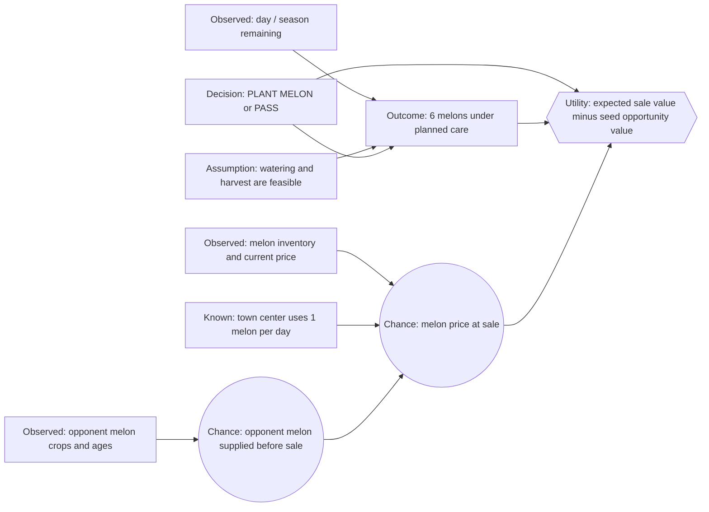

# Melon Decision Network — First Draft

This is the melon counterpart to the carrot planting example and shares the
same one-time-crop decision shape as wheat. It asks:

> Given one empty, unlocked tile and a melon seed we already own, should we
> plant melon now or choose `PASS`?

The graph skeleton is intentionally parallel to wheat. Its long wait to
harvest and sharply different market response make its assumptions distinct.

## Scope

- One empty, unlocked tile and one seed already in our seed inventory.
- Compare `PLANT MELON` with `PASS`.
- Assume the crop can be cared for through its intended harvest.
- Estimate sale value without choosing other crops, modeling labor across many
  tiles, or adding a general market-timing policy.
- Do not assign unmeasured probabilities to future prices yet.

## Fixed melon facts

| Game fact | Default value |
|---|---:|
| Seed replacement cost | 80 coins |
| First harvestable yield | Age 10 days |
| Bonus-watering window | Ages 6–12 days |
| Planned yield with watering, no fertilizer | 6 melons, reached by age 10 |
| Maximum yield | 6 melons |
| Crop pattern | One-time harvest |
| Base market price | 250 coins per melon |
| Product buyback | Not allowed |
| Town-center demand | 1 melon per day |
| Shop demand | No shop type demands melon |
| Glut-price response | Square-shaped; severe as inventory rises above its anchor |

Melon's price curve uses an anchor inventory of 10,000 and a scale of 300.
The documented price is $300 at 300 below the anchor and reaches the $1 floor
at 300 above it; it remains at the floor at 600 above the anchor. This is a
fixed market rule; the uncertain input is how much inventory will change
before our harvest is sold.

The bonus window continues after the unfertilized crop has reached its yield
cap. The model's baseline harvest is age 10, when the planned six units are
available. Fertilizer is left out of the initial comparison.

## Starter influence diagram



Arrows mean that a parent helps determine a child. There is no future-shop
chance node for melon because no shop consumes it. The town-center demand is
known; uncertainty about the price comes mainly from market inventory and
future player supply, especially opponent harvests.

## Initial decision rule

```tex
U(\operatorname{PASS}) = 0
```

```tex
U(\operatorname{PLANT\ MELON})
= 6 \times E[\operatorname{MelonSalePrice}]
- 80
```

The 80 coins represent the opportunity value of using a seed we already own,
initially approximated by its replacement cost. They are not a new cash
purchase on this turn. Tile use and labor costs start at zero, matching the
simple carrot model; they can become separate terms later.

Choose `PLANT MELON` only when its expected utility is strictly greater than
`PASS`.

### Provisional code assumption

The first executable version uses today's observed melon quote as a
point-estimate of the quote at harvest (a multiplier of 1.0). It therefore
calculates `6 * current_quote - 80`. This is a deterministic placeholder for
the future probability model, not a claim that melon prices remain unchanged
for ten days. The parameter lives in `agents/one_time_crop.py` as
`future_price_multiplier`.

The melon facts and policy adapters are in `agents/melon/shared.py`; its
independent entry points are `agents/melon/conveyor.py` and
`agents/melon/decision.py`.

For example, run the melon baseline against `pass` with a repeatable seed:

```bash
./run_match.py --agent agents/melon/conveyor.py --opponent pass --steps 720 --seed 42
```

To compare the two melon policies on the same seed, change `--agent` to
`agents/melon/decision.py` and `--opponent` to `agents/melon/conveyor.py`.

## Beliefs still to define

These are uncertain model inputs, not game facts:

- How much do current melon inventory and price predict the price ten days
  from now?
- How much do visible opponent melon crops, their ages, and the ten-day wait
  predict opponent supply at our sale time?
- How should the game's severe glut curve affect the probability of LOW price?

Unlike wheat, there is no future-shop demand variable to estimate. Market
prices follow a known function of inventory, but future inventory depends on
player sales and town consumption. A first belief model can use a small price
distribution without pretending to know those future sales exactly.

## Deliberately deferred

- Exact forward simulation of the market-price function.
- Sell-now versus hold-after-harvest decisions.
- Care scheduling across multiple tiles.
- Fertilizer and fertilizer purchase decisions.
- Crop choice against carrot, wheat, tomato, or strawberry.

The next learning step is to replace or compare the point estimate with a
small, inspectable representation for `MelonSalePrice` (for example, LOW /
NORMAL / HIGH), then identify evidence and initial probability assumptions
for each state.
