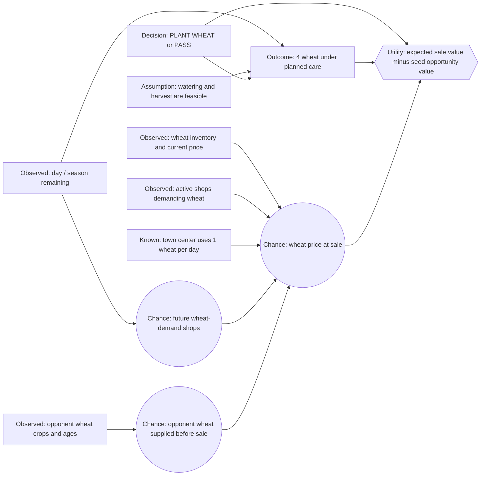

# Wheat Decision Network — First Draft

This is the wheat counterpart to the carrot planting example. It asks one
narrow question:

> Given one empty, unlocked tile and a wheat seed we already own, should we
> plant wheat now or choose `PASS`?

This first network treats wheat only as a crop. Its possible use as animal
feed belongs to a later production-chain network.

## Scope

- One empty, unlocked tile and one seed already in our seed inventory.
- Compare `PLANT WHEAT` with `PASS`.
- Assume the crop can be cared for through its intended harvest.
- Estimate the value of selling the harvest; do not model animals, feed
  inventory, crop choice across all species, or market buy/sell arbitrage.
- Do not assign unmeasured probabilities to future prices yet.

## Fixed wheat facts

| Game fact | Default value |
|---|---:|
| Seed replacement cost | 10 coins |
| First harvestable yield | Age 2 days |
| Bonus-watering window | Ages 2–4 days |
| Planned yield with watering, no fertilizer | 4 wheat |
| Maximum yield with fertilizer | 6 wheat |
| Crop pattern | One-time harvest |
| Base market price | 25 coins per wheat |
| Product buyback | Allowed (`BUY_PRODUCT WHEAT`) |
| Town-center demand | 1 wheat per day |
| Shop demand | Bakery, Pizza Shop, Brunch Spot, Ice Cream Shop, Farmers Market |

Wheat's price curve uses an anchor inventory of 10,000 and a scale of 400.
The documented prices are $45 at 400 below the anchor, $20 at 400 above it,
and $19 at 800 above it. This is a fixed market rule; the uncertain input is
the market inventory when our harvest is sold.

The product buyback fact is recorded for accuracy, but this network does not
choose whether to buy wheat from the market. Likewise, wheat's animal-feed use
is deliberately excluded.

## Starter influence diagram



Arrows mean that a parent helps determine a child. The crop yield is treated
as a deterministic outcome under the stated care plan; uncertainty in the
first draft is concentrated in the sale price.

## Initial decision rule

```tex
U(\operatorname{PASS}) = 0
```

```tex
U(\operatorname{PLANT\ WHEAT})
= 4 \times E[\operatorname{WheatSalePrice}]
- 10
```

The 10 coins represent the opportunity value of using a seed we already own,
initially approximated by its replacement cost. They are not a new cash
purchase on this turn. Tile use and labor costs start at zero, matching the
simple carrot model; they can become separate terms later.

Choose `PLANT WHEAT` only when its expected utility is strictly greater than
`PASS`.

### Provisional code assumption

The first executable version uses today's observed wheat quote as a
point-estimate of the quote at harvest (a multiplier of 1.0). It therefore
calculates `4 * current_quote - 10`. This is a deterministic placeholder for
the future probability model, not a claim that wheat prices remain unchanged.
The parameter lives in `agents/one_time_crop.py` as
`future_price_multiplier`.

The wheat facts and policy adapters are in `agents/wheat/shared.py`; its
independent entry points are `agents/wheat/conveyor.py` and
`agents/wheat/decision.py`.

For example, run the wheat baseline against `pass` with a repeatable seed:

```bash
./run_match.py --agent agents/wheat/conveyor.py --opponent pass --steps 720 --seed 42
```

To compare the two wheat policies on the same seed, change `--agent` to
`agents/wheat/decision.py` and `--opponent` to `agents/wheat/conveyor.py`.

## Beliefs still to define

These are uncertain model inputs, not game facts:

- How much do current wheat inventory, quoted price, and active wheat-demand
  shops predict the price when this crop is sold?
- How much does the number and age of visible opponent wheat crops predict
  opponent supply before our sale?
- Which future shop draws can occur before our harvest, and how should their
  demand affect the sale-price estimate?

The game draws shop types uniformly with replacement from eight types. Five
shop types demand wheat. That gives a factual prior for a single future draw,
but does not by itself determine the future price: current inventory, town
consumption, and player sales also matter.

## Deliberately deferred

- Wheat as feed for geese, cows, or sheep.
- Whether to preserve wheat for future feed instead of selling it.
- Buying wheat as a commodity.
- Care scheduling across multiple tiles.
- Fertilizer and fertilizer purchase decisions.
- Crop choice against carrot, melon, tomato, or strawberry.

The next learning step is to replace or compare the point estimate with a
small, inspectable representation for `WheatSalePrice` (for example, LOW /
NORMAL / HIGH), then identify evidence and initial probability assumptions
for each state.
