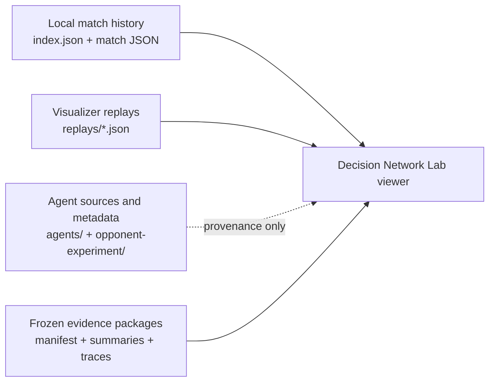

# Lab Workspace Instructions

These instructions apply to every agent working anywhere under `labs/`.

The labs directory is an exploratory workspace. A lab may contain prototypes,
experiments, visualizations, evaluation tools, or learning materials. Keep
each lab understandable to a future beginner and keep unrelated labs
independent.

## Before working

1. Read this file.
2. Read the lab's own instructions, if it has an `AGENTS.md`.
3. Read the lab's question log and architecture decision log before changing
   direction or adding a new component.
4. Check `git status` and preserve changes made by other people or agents.
5. State the current question or goal before making a substantial change.

## Required lab records

Each lab directory must maintain these two files at its root:

- `QUESTIONS.md` — the question-and-answer record, including unresolved
  questions.
- `ARCHITECTURE_DECISIONS.md` — the running architectural decision log.

If a lab does not have these files yet, create them before substantial
implementation work begins. Creating or improving the records is itself a
valid first phase when the lab's direction is still being planned.

Do not use the conversation as the only place where an important question or
decision exists. The files are the durable handoff between chats and agents.

## Question-and-answer log

Keep `QUESTIONS.md` beginner-readable and append new entries instead of
rewriting history.

Use this structure:

```markdown
# Questions and answers

## Open questions

### Q-001 — Short question title

- Asked: YYYY-MM-DD
- Question: What still needs an answer?
- Why it matters: What decision or work depends on it?
- Current evidence: Links, observations, or test results.
- Owner or next step: Who will investigate what?
- Status: Open

## Answered questions

### Q-002 — Short question title

- Asked: YYYY-MM-DD
- Question: What was asked?
- Answer: The agreed answer in plain language.
- Evidence: Links to the supporting code, document, or experiment.
- Answered: YYYY-MM-DD
- Follow-up: Any remaining work or `None`.
- Status: Answered
```

Rules:

- Record an important question before silently making an assumption.
- Put unresolved questions under `Open questions`.
- When a question is answered, preserve the original question and add the
  answer; do not delete it.
- Distinguish facts, assumptions, proposals, and decisions.
- Link to evidence where possible.
- If an answer changes an architecture decision, update both logs.

## Architectural decision log

Keep `ARCHITECTURE_DECISIONS.md` as an append-oriented record. It should
explain why the lab has its current shape, not merely list files.

Use this structure:

```markdown
# Architectural decisions

## Decision summary

| ID | Title | Status | Date |
|---|---|---|---|
| ADR-001 | Short decision title | Accepted | YYYY-MM-DD |

## ADR-001 — Short decision title

- Date: YYYY-MM-DD
- Status: Proposed, Accepted, Rejected, Superseded, or Deferred
- Context: What problem or choice required a decision?
- Decision: What are we choosing?
- Alternatives considered: What else was considered?
- Consequences: What becomes easier, harder, or constrained?
- Evidence: Links to tests, experiments, or documentation.
- Supersedes: ADR id or `None`.
```

Rules:

- Write an ADR before making a material architectural change.
- Use `Proposed` while discussing a decision and `Accepted` only after the
  responsible human or agreed project process approves it.
- Do not silently edit an accepted decision to change its meaning. Add a new
  ADR and mark the old one `Superseded` when necessary.
- Keep decisions small enough to review independently.
- Record rejected and deferred alternatives when they help future agents avoid
  repeating the same investigation.
- Do not call an experiment successful without recording its evidence and
  limits.

## Collaboration across chats and worktrees

Agents may work in separate chats or worktrees, but the logs are shared
coordination points.

- A UI-focused agent may change UI files without changing model files.
- A model-focused agent may change model files without changing UI files.
- An evaluation-focused agent may add experiments and evidence without
  changing the live policy unless explicitly authorized.
- If work crosses a boundary, record the dependency in the relevant question
  or ADR before editing the other area.
- Do not have two agents simultaneously redefine the same public contract.
  Record the proposed contract first, then coordinate the change.
- Keep commits and changes narrow enough that another chat can review or
  continue them independently.

## Local run and agent viewer workflow

The Decision Network Lab can review evidence produced by the sibling
Kaggriculture workspaces. This is a useful discovery surface because other
agents may add valuable runs, agent definitions, experiments, or replay files
there.

Keep these source groups separate:



### Source locations

The current local producer and viewer sources are:

- Match history producer: `D:\Repos\kaggriculture.worktrees\full-simulation-ingest-docs-history`
- Match-history directory: `D:\Repos\kaggriculture.worktrees\full-simulation-ingest-docs-history\.local_match_history`
- Agent catalog metadata: `local_match_server.py` in that producer workspace
- Agent source folders: `agents/` and `opponent-experiment/` in that workspace
- Visualizer replays: `D:\Repos\kaggle-environments\kaggle_environments\envs\kaggriculture\visualizer\default\replays`
- Frozen lab package: `labs/decision-network-lab/evaluation/results/`

The producer may rotate `.local_match_history` into
`.local_archive/<timestamp>/local_match_history`. The viewer is expected to
fall back to the newest archive snapshot when the live directory is absent.
Treat archived snapshots as valuable historical evidence; do not delete,
rename, or reorganize them from the lab.

### How to investigate a new run or agent

1. Start the local viewer from `labs/decision-network-lab` with the Server
   project, not the client-only project:

   ```powershell
   dotnet run --project src/DecisionNetworkLab.Server/DecisionNetworkLab.Server.csproj
   ```

2. Open `http://127.0.0.1:5192/` and use the three evidence tabs:
   - **Local match history** — who played whom, winner, rewards, seed, and
     day-by-day recording timeline.
   - **Replay recordings** — visualizer replay files, reviewed through their
     separate adapter.
   - **Frozen evidence packages** — paired baseline/candidate summaries and
     decompressed decision traces.
3. For a promising run, record its `id`, `createdAt`, `agent`, `opponent`,
   `winner`, `seed`, `source`, and recording path before interpreting it.
4. Inspect the agent metadata and source separately. Descriptions, traits,
   experiment rounds, and approximation markers explain provenance; they do
   not prove that a policy won a run.
5. Compare multiple fixed-seed runs before calling a behavior or agent
   interesting. One run is an observation, not a conclusion.

### Safety and evidence boundaries

- Read sibling run and agent directories; do not copy their recordings into a
  lab unless a human explicitly asks for a frozen artifact.
- Do not execute Python agents from the browser or from the viewer backend.
- Do not treat a replay as match history, or an agent source file as evidence
  of behavior.
- Do not overwrite or “clean up” another agent's run output.
- If the source directory changes, update the lab Server configuration and the
  relevant question/architecture log instead of silently hard-coding a new
  path.
- When a new agent or run appears, preserve its creator metadata and source
  provenance in the review surface whenever the format provides it.

## Documentation style

- Write for a technically curious beginner.
- Explain the reason before the mechanism when introducing a design.
- Prefer short examples and named concepts over unexplained abstractions.
- Use UML diagrams when they clarify structure, relationships, sequence, or
  interaction. UML is a preferred teaching and planning format in this lab
  workspace.
- Always accompany a diagram with plain-language text. Explain what the
  reader should notice and how the diagram relates to the implementation.
- Keep temporary notes clearly marked as temporary.
- Preserve links to source files, experiments, and external references.

## Scope and safety

- Do not broaden a lab into a product, service, or framework without an ADR.
- Do not add a dependency, external API, cloud resource, credential, or
  service integration without explicit approval and a recorded decision.
- Start with read-only inspection when the requested direction is unclear.
- Run the smallest relevant verification after changes.
- End substantial work by reporting what changed, what was verified, what is
  uncertain, and the next smallest useful step.
