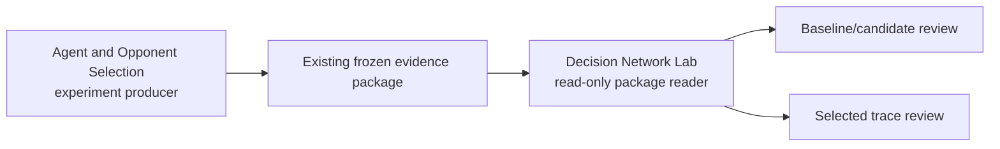
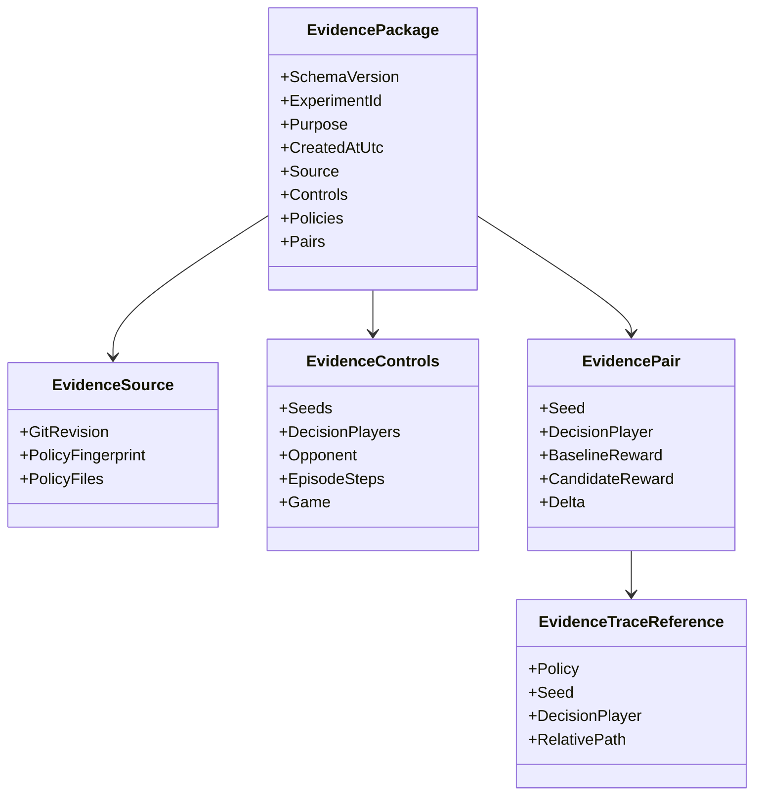

# Phase 2 evidence contract

This document defines the boundary between existing local recordings,
experiment producers, and the Decision Network Lab UI.

The producer may live in another worktree or chat. The lab does not copy its
run history into this project. The future reader consumes an evidence package
where it already exists, preferably through a user-selected local package.

## Purpose

Phase 1.5 answers:

> What would this decision network do for these current values?

Phase 2 answers:

> What actually happened across controlled local simulator runs?

The evidence reader must remain descriptive. It must not decide that a policy
is better, change a live agent, or call Foundry.

## Producer and reader boundary



The producer owns simulator execution, policy selection, fixed seeds, and
artifact creation. The lab owns validation, normalization, and presentation.

## Evidence source groups

Phase 2 has two recording groups and one provenance group:

| Group | Current source | First responsibility |
|---|---|---|
| Local match history | `.local_match_history/index.json` plus match JSON files | Catalog and open recorded matches |
| Replay recordings | Kaggriculture visualizer `replays/*.json` | Open replay timelines through a separate adapter |
| Agent provenance | `opponent-experiment/` and `agents/` | Identify source agents; never execute them in the browser |

The groups must remain visibly distinct in the UI. A match recording is not
automatically a visualizer replay, and an agent source file is not evidence.

## Current package shape

The existing local producer writes a directory with this shape:

```text
experiment-package/
├── manifest.json
├── comparison-summary.json
├── run-summaries.jsonl
└── decision-traces/
    └── <policy>-seed-<seed>-seat-<seat>.json.gz
```

The first observed package uses schema version `1.0` and contains these
manifest sections:

| Section | Meaning |
|---|---|
| `schema_version` | Version of the package contract |
| `experiment_id` | Stable human-readable experiment identity |
| `purpose` | Why the experiment was run |
| `created_at_utc` | Package creation time |
| `source` | Git revision, policy fingerprint, and policy files |
| `controls` | Seeds, seats, opponent, episode length, and game |
| `policies` | Baseline and candidate identifiers |
| `artifacts` | Relative paths to summaries and traces |

The reader must treat relative artifact paths as package-local paths. It must
not guess paths outside the selected package.

## Required normalized reader model

The client should normalize the package into these concepts:



The reader should keep observed values separate from later interpretation:

- rewards and statuses are observations;
- policy names and source revisions identify provenance;
- deltas are descriptive arithmetic, not a verdict;
- trace beliefs are what the policy recorded, not facts supplied by the game.

## Pairing rule

Baseline and candidate rows form a pair only when these keys match:

```text
(seed, decision_player)
```

If either side is missing, the reader should show the row as incomplete rather
than silently pairing it with a different run.

## First reader scope

The implementation loads, validates, and displays:

1. `manifest.json`;
2. `comparison-summary.json`;
3. `run-summaries.jsonl`;
4. one selected compressed trace;
5. one selected local match recording;
6. one selected visualizer replay recording.

The first UI review should show:

- experiment identity and purpose;
- source revision and policy labels;
- fixed controls;
- baseline/candidate means;
- paired-run table;
- one selected trace preview;
- a visible “descriptive evidence” label.

It does not:

- run Python from the browser;
- submit to Kaggle;
- call a server API;
- compare unpaired runs;
- declare a policy improvement;
- import arbitrary formats without a versioned adapter.

## Match-history catalog shape

The local match-history utility maintains an `index.json` catalog. Each entry
identifies a recording with fields such as:

- `id` and `createdAt`;
- `agent` and `opponent`;
- `days`, `steps`, and `seed`;
- `rewards`, `statuses`, and `winner`;
- `source` and a package-relative recording `path`.

The catalog loads without loading every large match recording. Selecting one
recording opens a day-by-day timeline with each player's action, reward,
status, and compact observation facts.

The current UI presents the catalog as an expandable list. The recorded
launcher calls the selected agent as Player 1 and the selected opponent as
Player 2, so a winner label such as `Player 1` can be explained as the agent
winning without inspecting the full recording. The list also exposes the
record's rewards, seed, season length, statuses, timestamp, source, ID, and
relative recording path.

The configured producer history directory is:

```text
D:\Repos\kaggriculture.worktrees\full-simulation-ingest-docs-history\.local_match_history
```

The local host prefers that directory and falls back to the newest archived
`local_match_history` snapshot if the producer rotates it. The recordings stay
in their original folders. Agent descriptions, traits, and source
classifications belong to the separate agent-provenance catalog and are not
inferred from the match index.

## Browser loading boundary

Blazor WebAssembly cannot directly browse another worktree folder. The lab
therefore uses a minimal local ASP.NET Core host when run through the Server
project. The host reads the configured `index.json` and agent catalog in
read-only mode and returns normalized metadata to the client. It does not run
Python, execute agents, or copy experiment history into this repository.

The client-only file-input boundary remains a fallback design for a future
static-only deployment, but it is not the normal local workflow.

A server endpoint is justified here because the user explicitly wants the lab
to use an existing Windows directory automatically. It remains local-only and
is deliberately limited to the configured evidence sources.

## Validation failures

The reader should report beginner-readable errors for:

- missing `manifest.json`;
- unsupported `schema_version`;
- missing declared artifact;
- malformed JSON or JSONL;
- duplicate `(seed, decision_player, policy)` rows;
- incomplete baseline/candidate pairs;
- trace references that do not match the package contents.

These are evidence-package errors, not model errors. The UI should keep that
distinction visible.

## Phase 2 implementation order

```text
Contract and validation types
        ↓
Local file/package selection
        ↓
Manifest and summary loading
        ↓
Paired comparison view
        ↓
Selected trace loading
        ↓
Browser verification and tests
```

The Phase 2 implementation is complete for the current sources. Future work
may add richer raw-observation views, replay-specific visual styling, and
additional evidence-package schemas without changing the local-only boundary.
