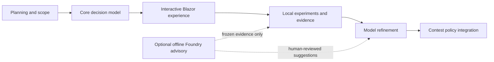
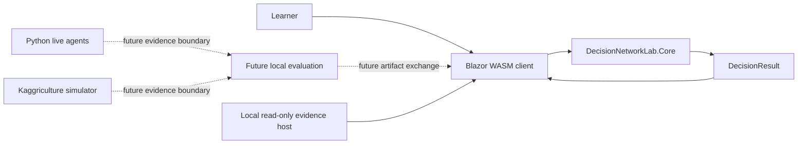
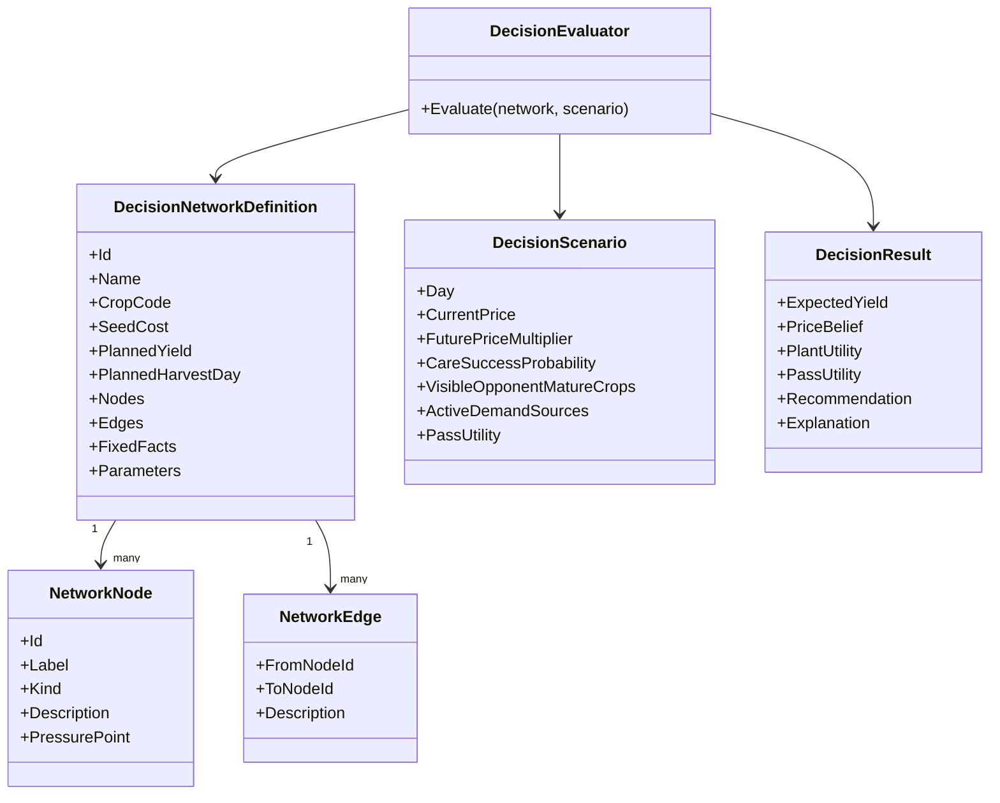
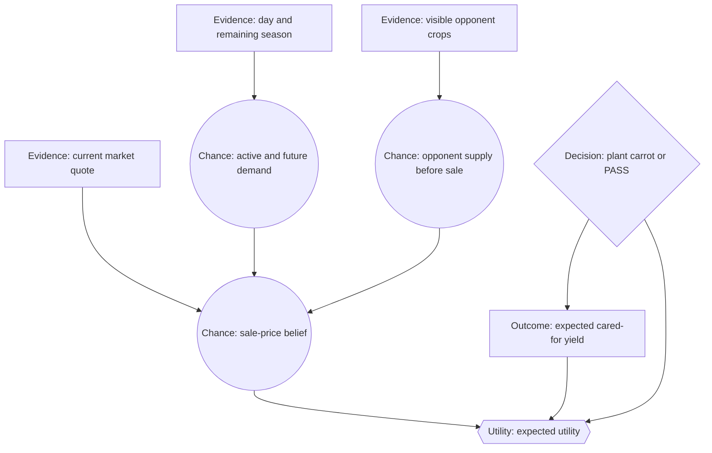
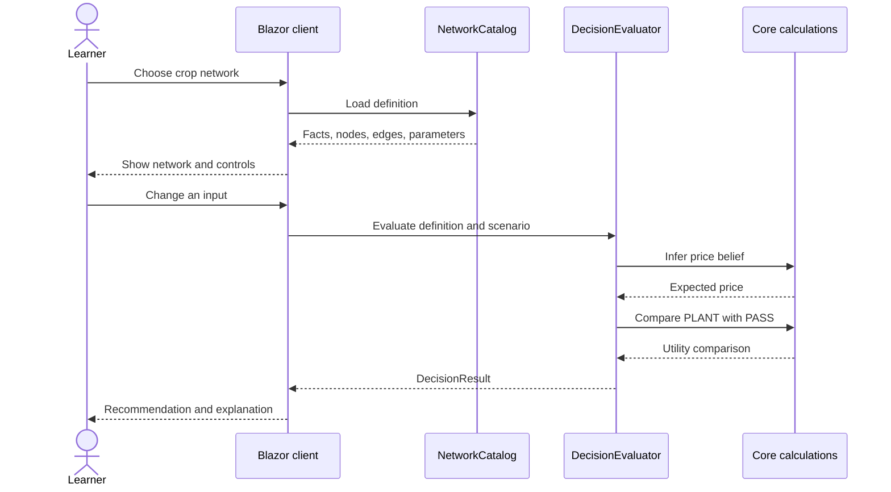
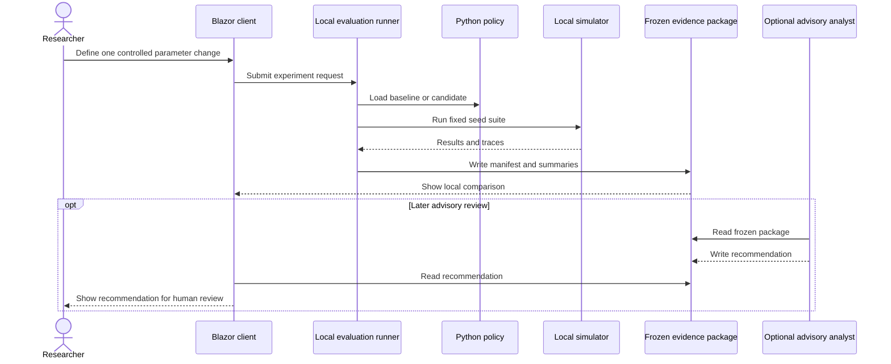

# Decision Network Lab

This lab is the first user experience for learning from the Kaggriculture
decision-network work. It is a small Blazor WebAssembly tool with a minimal
local read-only host for
asking:

> Given the current evidence and assumptions, should the farmer plant this crop
> or choose `PASS`?

The lab is deliberately a learning tool, not the live Kaggriculture agent and
not a Foundry runtime. It makes assumptions visible, lets a learner change one
input at a time, and explains the resulting utility comparison.

## Current scope

The first slice includes the three confirmed one-time crop networks:

- Carrot — the first coarse supply and demand belief model;
- Wheat — a point estimate using today's quote;
- Melon / watermelon — a point estimate using today's quote.

The UI currently supports:

1. choosing a crop network;
2. changing day, price, care success, and policy assumptions;
3. changing carrot-specific visible-supply and demand evidence;
4. viewing fixed game facts separately from tunable assumptions;
5. comparing expected `PLANT` utility with `PASS` utility;
6. reading a plain-language explanation of the recommendation;
7. exploring an interactive Mermaid-generated SVG diagram with arrowed
   information flow, live values, selectable nodes, and causal highlighting.
8. using scenario presets and sliders to change assumptions without typing
   every value;
9. following a structured decision trace in the same evidence-to-decision
   order as the UML diagram;
10. running a seeded, narrow local simulator for immediate teaching feedback;
11. reviewing Phase 2 evidence on the same screen, including a local
   match-history catalog with expandable run details.

This first slice does not yet run the full Kaggriculture simulator, call the
Python agents, call Foundry, or persist experiment results. The local host only
reads the configured match-history directory and agent catalog; it does not
execute agent code or copy recordings. The evidence panel loads the existing
local match-history `index.json` as a descriptive run list. Each match-history
entry shows the agent-versus-opponent pairing, winner, rewards, seed, season
length, statuses, timestamp, source, recording path, and available creator
metadata.
Full match recording review, replay review, and compressed decision-trace
review are available through the local read-only host.

The presentation layer uses the approved `Microsoft.FluentUI.AspNetCore.Components`
package for cards, controls, buttons, and providers. The decision-network SVG
is generated by the pinned Mermaid browser renderer, and the teaching-specific
layout remains local CSS. Mermaid node clicks are bridged back to Blazor for
selected-node explanations.

## Roadmap and phase status

The lab is intentionally being built in layers. The lab experience is a
learning and evidence tool; it is not the live contest agent.



### Phase 0 — Planning and boundaries

Status: complete.

- Defined the Decision Network Laboratory as the first user experience.
- Confirmed the initial scope: carrot, wheat, and melon/watermelon.
- Separated the lab from the live Python policy, simulator, and Foundry work.
- Established the lab question log and architecture decision log.

### Phase 1 — Decision Network Laboratory

Status: first vertical slice and core test suite implemented; model-review
questions remain deferred.

Completed:

- standalone Blazor WebAssembly client;
- separate calculation core and presentation client;
- three crop definitions and basic evaluators;
- `PLANT` versus `PASS` utility comparison;
- fixed facts versus scenario assumptions;
- Mermaid topology reference;
- interactive, keyboard-accessible Mermaid-generated SVG diagram;
- dark, wide-screen layout with selected-node details beside the graph;
- beginner documentation and durable decision records.

Remaining before formally closing Phase 1:

1. Add automated core tests for the three crop evaluators. **Complete: 10
   MSTest tests pass.**
2. Browser-check carrot, wheat, and melon after the final layout changes. **Complete.**
3. Verify node selection and keyboard interaction in the Mermaid diagram.
   **Node selection is confirmed working for all three graphs.**
4. Decide whether `MarketInventory` is a real Phase 1 input or should remain
   deferred until the evidence/simulation phase. **Deferred until the new
   carrot decision graph is available.**
5. Review the displayed assumptions against the source decision-network
   documents and record any intentional simplifications. **Deferred until the
   new carrot decision graph is available.**

The automated test suite is complete. The two deferred model-review questions
must not block the next phase.

### Core test coverage

The [DecisionNetworkLab.Core.Tests](tests/DecisionNetworkLab.Core.Tests/)
project checks:

- the three-network catalog;
- graph edge integrity;
- default `PLANT` recommendations;
- carrot LOW/NORMAL/HIGH probability values;
- carrot supply evidence changing expected price;
- wheat point-price multipliers;
- care risk making planting unattractive;
- melon season-horizon gating.

### Phase 2 — Local experiments and evidence

Phase 2 has two connected parts: generate trustworthy local evidence and make
that evidence understandable in the lab UI. The UI should not become a live
simulator or hidden policy engine; it should be a read-only, evidence-focused
view of completed experiments.

Next after Phase 1 acceptance:

- fixed-seed experiment requests;
- baseline-versus-candidate comparisons;
- one-parameter changes;
- lifecycle summaries and decision traces;
- frozen JSON evidence packages for later review;
- a lab UI view for loading an experiment package;
- comparison panels for baseline versus candidate outcomes;
- decision-trace and plant/pass summaries;
- evidence links from a displayed result back to its manifest and source
  revision;
- a clear distinction between observed results, model predictions, and later
  advisory commentary.

Phase 2 status: complete for the current evidence sources.

- the Core reader validates schema version, required manifest fields, paired
  seed/seat results, and baseline/candidate summaries;
- the client can read the three JSON artifacts from a user-selected local
  package without copying runs into the repository;
- the Phase 2 screen now separates Local match history from the future Replay
  recordings adapter;
- the local match-history catalog reader is implemented for `index.json`;
- the catalog is rendered as an expandable run list, with `Player 1` mapped to
  the recorded agent and `Player 2` mapped to the recorded opponent;
- the local host enriches matches with descriptions, traits, experiment rounds,
  source kinds, and approximation markers from the agent catalog without
  executing the Python source;
- a selected match or replay opens as a day-by-day, turn-by-turn timeline with
  actions, rewards, statuses, and compact observation facts;
- the frozen evidence package loads its compressed decision trace preview.

The Phase 1.5 local simulator is deliberately narrower than the Python
experiment runner. Phase 2 remains the experiment-review path for asking
“what happened across a fixed seed suite, under which controls, and what did
the policy believe?”

The first evidence producer is documented in
[evaluation/README.md](evaluation/README.md). It generates the manifest,
run-summary, and compressed trace artifacts that a later read-only UI view can
load.

The reader boundary and first package schema are documented in
[PHASE2_EVIDENCE_CONTRACT.md](PHASE2_EVIDENCE_CONTRACT.md). The lab consumes
existing packages; it does not copy simulator runs from another worktree.

### Phase 1.5 — Interactive decision experience

Status: complete for the current three-network scope.

The goal of this phase is to make the first screen an interactive laboratory,
not just a diagram with explanatory text.

The first increment includes:

- scenario presets and range controls;
- clear separation between current game state and model assumptions;
- structured action comparison values for `PLANT` and `PASS`;
- a causal decision trace shared by the core evaluator and the UI;
- a seeded local simulator for the three one-time crop examples;
- an automatically refreshed live local simulation when controls or seed change;
- Fluent UI presentation controls with the existing dark visual language;
- explicit separation between immediate teaching feedback and authoritative
  Python batch evidence.

The local simulator is intentionally small. It does not replace the Python
Kaggriculture simulator, and it does not promote its educational lifecycle
assumptions into game rules. Its purpose is to let a learner change a value and
immediately see one deterministic, seeded sample outcome alongside the
expected evaluation. The seed controls repeatability; it is not game state.
The full decision trace remains available to the network diagram and evidence
surfaces, but is intentionally not repeated in the Evaluation card.

Phase 1.5 acceptance:

1. Fluent controls, game-state labels, and assumption labels are browser-checked.
2. The three crop networks render with the focused Evaluation card.
3. The local sample refreshes when scenario controls or seed change.
4. Core evaluator tests pass for the three networks.

The Python evidence-package importer remains intentionally deferred to Phase 2.

## Deferred backlog — phase unassigned

These are real follow-up tasks, but they are intentionally not assigned to a
specific phase yet. Their ownership depends on the new carrot graph and the
experiment/evidence architecture.

- Integrate the new carrot decision graph.
- Import full Python evidence packages into the UI.
- Connect the browser experience to the Python simulator.
- Build formal sensitivity-sweep tooling.
- Resolve the current carrot graph/evaluator mismatches around care and
  timing.

### Phase 3 — Crop-model refinement

- replace wheat and melon point estimates with measured probability models;
- improve carrot belief calibration;
- score financial outcomes separately from belief accuracy;
- add care-feasibility reasoning where evidence supports it.

### Phase 4 — Advisory refinement

Foundry may inspect frozen local evidence and propose one falsifiable next
experiment. It must not choose live actions, mutate the policy automatically,
or replace local controlled evaluation.

### Phase 5 — Contest integration

Only after local evidence supports a policy should a selected local policy be
promoted into the contest-facing `main.py`. The live agent must continue to run
without Blazor, Foundry, cloud services, or LLM calls.

## Run locally

From this directory:

```powershell
dotnet run --project src/DecisionNetworkLab.Server/DecisionNetworkLab.Server.csproj
```

The local server builds the WebAssembly client, serves it on `http://localhost:5192`,
and exposes one read-only `/api/match-history` endpoint. The directory and
agent-catalog settings are in
[appsettings.json](src/DecisionNetworkLab.Server/appsettings.json). Change
those settings when using a different producer worktree. No cloud service or
external API is used.

## Reconstruct on a new machine

The lab is intended to be reconstructable from source rather than copied with
machine-specific build output.

1. Install the .NET SDK version recorded in [global.json](global.json).
2. Open a terminal in this directory.
3. Restore the exact package graph:

   ```powershell
   dotnet restore --locked-mode
   ```

4. Build or run the client:

   ```powershell
   dotnet build --no-restore
   dotnet run --project src/DecisionNetworkLab.Server/DecisionNetworkLab.Server.csproj --no-restore
   dotnet test --no-restore
   ```

The committed [client package lock](src/DecisionNetworkLab.Client/packages.lock.json)
and [test package lock](tests/DecisionNetworkLab.Core.Tests/packages.lock.json)
record the package versions and transitive dependencies. `bin/` and `obj/`
are intentionally ignored because they are generated again by restore and
build. The local NuGet cache is also not part of the repository; a new machine
downloads the declared Microsoft packages during restore.

If a package reference is intentionally changed, regenerate the lock file with
`dotnet restore --force-evaluate`, review the diff, and commit the updated lock
file with the project change.

## Separation of concerns

The lab has two projects in the first slice:

- `DecisionNetworkLab.Core` contains network definitions, scenario values,
  belief calculations, utility calculations, and explanations.
- `DecisionNetworkLab.Client` contains Razor components, browser interaction,
  and presentation styles.
- `DecisionNetworkLab.Server` contains only the local read-only evidence host
  and static client host. It does not run agents or the simulator.
- `DecisionNetworkLab.Core.Tests` verifies the core without starting a browser
  or simulator.

The client references the core. The core does not reference Blazor, HTML,
browser APIs, HTTP, or the Kaggriculture simulator.



The solid path is the implemented path. Dashed paths are deliberately deferred
so the first experience can remain understandable and usable offline after it
has been downloaded.

## Core model

The main model types are intentionally small. A network definition describes
the teaching content. A scenario contains the learner's current inputs. The
evaluator returns a complete result for the UI to display.



The important teaching point is that the UI does not calculate utility. It
passes a scenario to the evaluator and renders the result.

## Mermaid layout reference

The interactive SVG follows this Mermaid topology for the carrot network. The
purpose of this diagram is to make the intended reading order explicit before
the UI adds selection and responsive sizing:



The SVG uses the same layered reading order: evidence at the top, uncertainty
in the middle, the decision and outcome below it, and utility at the bottom.
This is why the SVG layout is intentionally network-specific rather than a
generic row-major card grid.

## First user interaction



This is a synchronous local interaction. There is no network request between
changing an input and seeing a result.

## Future experiment interaction

The eventual experiment path must remain separate from the live decision
calculation:



Foundry must not choose a live game action, mutate the policy, or replace the
local controlled experiment.

## Beginner reading guide

- **Fixed facts** come from the game rules. They are not adjusted to improve a
  result.
- **Beliefs** describe uncertain things, such as future price or opponent
  supply.
- **Preferences** describe how the policy values an action, such as the value
  assigned to `PASS`.
- **Utility** is the common scale used to compare the two available actions.
- **The UI** makes these ideas visible but does not own their meaning.

Read [QUESTIONS.md](QUESTIONS.md) for unresolved and answered questions.
Read [ARCHITECTURE_DECISIONS.md](ARCHITECTURE_DECISIONS.md) for the reasons
behind the current shape.
