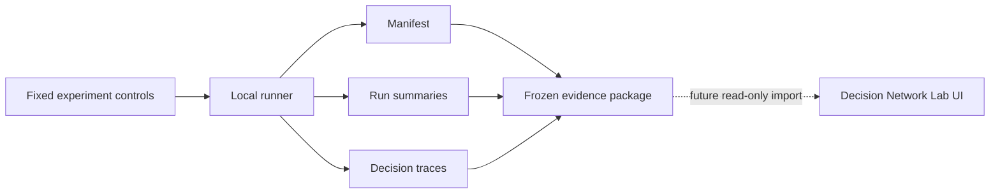

# Local experiment evidence

This directory is the Phase 2 boundary between the local Kaggriculture
simulator and the Decision Network Lab UI.

The runner is intentionally separate from the Blazor projects and from the
live agent policy. It produces frozen JSON evidence; it does not change agent
parameters, choose live actions, call Foundry, or call a web service.

## Current experiment

`run_carrot_experiment.py` compares:

- the current carrot decision policy;
- the carrot conveyor baseline;
- the fixed `pass` opponent;
- the same seed suite and both player positions.

The default seed suite is `42,43,44` and the default episode length is 720
turns.

## Run it

Run this from the repository root in the Python environment that already has
the local `kaggle_environments` package:

```powershell
python labs/decision-network-lab/evaluation/run_carrot_experiment.py
```

In this workspace, the package is available from the sibling source checkout
at `D:\Repos\kaggle-environments`. From PowerShell, the reproducible local
source-checkout form is:

```powershell
$env:PYTHONPATH = "D:\Repos\kaggle-environments;$PWD"
python labs\decision-network-lab\evaluation\run_carrot_experiment.py
```

The sibling checkout currently emits an optional `pyspiel` warning while it
loads unrelated environments; Kaggriculture itself runs successfully.

For a shorter smoke experiment:

```powershell
python labs/decision-network-lab/evaluation/run_carrot_experiment.py --seeds 42 --steps 24
```

The result package is written under the ignored `evaluation/results/` folder.
It contains:

- `manifest.json` — experiment purpose, controls, source fingerprints, and
  artifact names;
- `run-summaries.jsonl` — one outcome row per policy, seed, and seat;
- `comparison-summary.json` — paired descriptive candidate-minus-baseline
  deltas, explicitly marked as non-conclusive;
- `decision-traces/*.json.gz` — candidate decision-time evidence and action
  traces.

## Evidence contract



The package records observed results separately from the candidate's beliefs.
That lets later UI work distinguish:

- what the agent predicted;
- what the simulator observed;
- which controls produced the observation;
- which policy revision produced the action.

The current machine does not have `kaggle_environments` installed. The script
reports that prerequisite clearly instead of installing a dependency or
silently running a substitute simulator.
