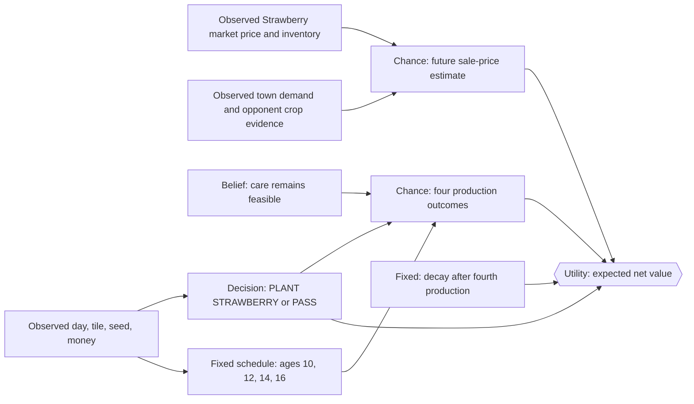

# Strawberry Decision Network

Strawberry uses the same ongoing-crop graph as Tomato. The narrow question is:

> Given one empty unlocked tile and a Strawberry seed or enough money to buy
> one, should the farmer plant Strawberry now or choose `PASS`?

## Fixed Strawberry facts

| Fact | Default value |
|---|---:|
| Seed cost | 100 |
| Base market price | 120 |
| Production ages | 10, 12, 14, 16 |
| Scheduled productions | 4 |
| Base yield per production | 1 |
| Fertilized and watered production yield | 2 |
| Care | Water every day |
| After the fourth production | Plant begins decay |

These are game rules, not tunable policy weights.

## Influence diagram

The schedule is deterministic. The first model uses named care and future
price assumptions without pretending the game mechanics themselves are
uncertain.

## Utility

$$
E[Yield_i] = P(CareSuccess) \times 1
$$

$$
U(PlantStrawberry) =
\sum_{i=1}^{4} E[Yield_i \times SalePrice_i]
 - SeedOpportunityValue
$$

$$
U(PASS)=0
$$

Plant only when:

$$
U(PlantStrawberry) > U(PASS)
$$

The initial implementation uses today's quote as a point estimate multiplied
by `future_price_multiplier`. A later version can use a calibrated price
distribution.

## Lifecycle and limitations

The farmer waters the plant every day. `HARVEST` collects available units but
leaves the Strawberry plant on the tile for later production ages. After age
16's production, the game begins post-production decay.

This first graph models one farmer and one active crop. It excludes fertilizer
acquisition, market timing, crop portfolios, hired hands, animals, and wheat
feed chains.
